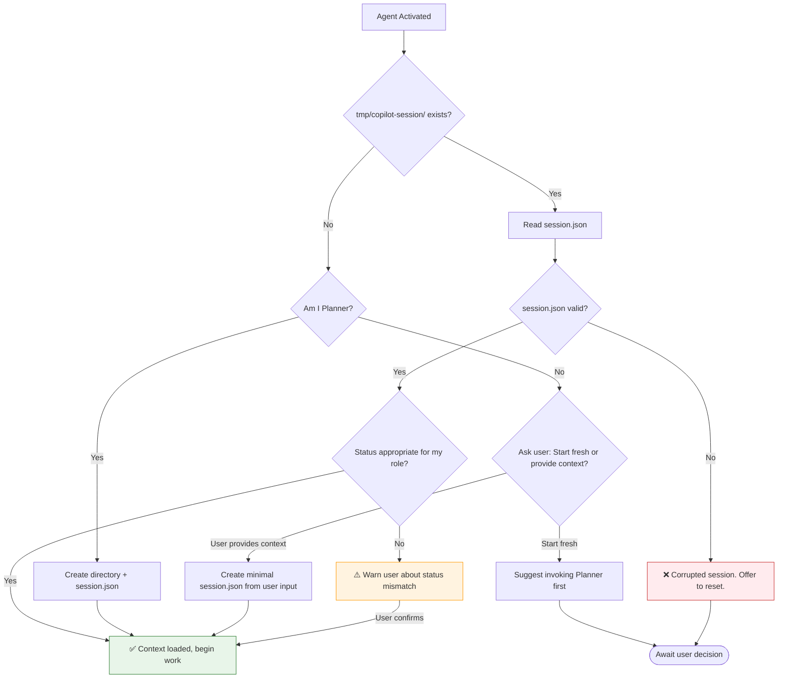

# Artifact Management Protocol

All agents MUST follow this protocol for session continuity across agent invocations.

## Session Directory

```
tmp/copilot-session/
├── session.json          # Current task state (REQUIRED)
├── spec.md               # Implementation specification
├── test-status.json      # Test run tracking
├── review-findings.md    # Review notes
└── decisions.md          # Architecture decisions log
```

## Startup Sequence



## Expected Status by Agent

| Agent | Typical Status When Invoked | Sets Status To |
|-------|----------------------------|----------------|
| Planner | (none) / any | `planning` → `implementing` or `reviewing` |
| Implementer | `implementing` | `testing` |
| Tester | `testing` | `reviewing` |
| Reviewer | `reviewing` | `documenting` or back to `implementing` |
| Documenter | `documenting` | `pr_ready` |
| PR_Writer | `pr_ready` | `complete` |
| Cypress_Debugger | `testing` | stays `testing` |

**Note:** Users may invoke agents directly at any point. Agents should:
1. Check for existing session
2. If missing/mismatched, ask user for context or suggest appropriate agent
3. Never refuse to work - adapt to what the user needs

## Shutdown Sequence

```mermaid
flowchart TD
    Done[Work Complete] --> Update[Update session.json]
    Update --> SetProgress[Set progress.{agent} = 'complete']
    SetProgress --> SetStatus[Set status to next stage]
    SetStatus --> AddNote[Add handoff_note with summary]
    AddNote --> UpdateArtifacts[Update relevant artifact files]
    UpdateArtifacts --> Output[Output: Summary + suggested next agent]
    
    style Output fill:#e3f2fd,stroke:#1565c0
```

## Artifact Update Rules

| Artifact | Who Creates | Who Updates |
|----------|-------------|-------------|
| `session.json` | Planner | All agents (every session) |
| `spec.md` | Planner | Implementer (minor clarifications) |
| `test-status.json` | Tester | Tester, Cypress_Debugger |
| `review-findings.md` | Reviewer | Reviewer |
| `decisions.md` | Any agent | Any agent making architectural choices |

## Direct Invocation Handling

When an agent is invoked without a prior session:

1. **Check for session:** `ls tmp/copilot-session/session.json`
2. **If exists:** Load and validate, warn if status mismatch
3. **If missing:** 
   - Ask user: "No active session found. Would you like me to:"
     - a) Start fresh (I'll gather context and create session)
     - b) Work on specific files you point me to
   - Create minimal session.json based on user input
4. **Never block:** Always find a way to help the user

## Reset Command

If session is corrupted or needs fresh start:
```bash
rm -rf tmp/copilot-session && mkdir -p tmp/copilot-session
```
Then invoke Planner to initialize properly.
