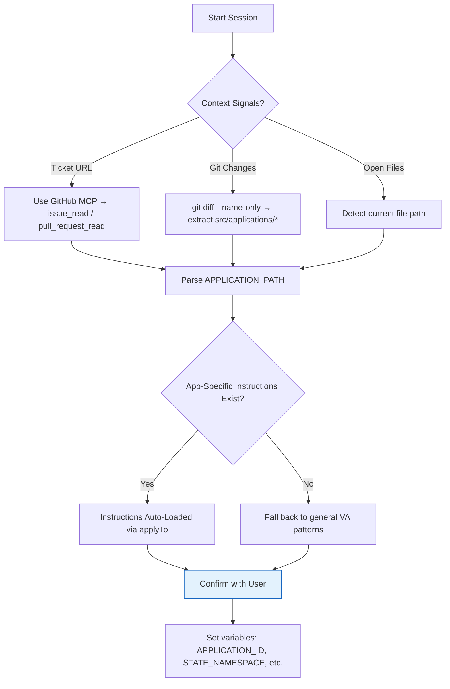

```mermaid
flowchart TD
    A[Start Session] --> B{Context Signals?}
    B -->|Ticket URL| C[Use GitHub MCP → issue_read / pull_request_read]
    B -->|Git Changes| D[git diff --name-only → extract src/applications/*]
    B -->|Open Files| E[Detect current file path]
    C & D & E --> F[Parse APPLICATION_PATH]
    F --> G{App-Specific Instructions Exist?}
    G -->|Yes| H[Instructions Auto-Loaded via applyTo]
    G -->|No| I[Fall back to general VA patterns]
    H & I --> J[Confirm with User]
    J --> K[Set variables: APPLICATION_ID, STATE_NAMESPACE, etc.]
    style J fill:#e3f2fd,stroke:#1565c0
```
