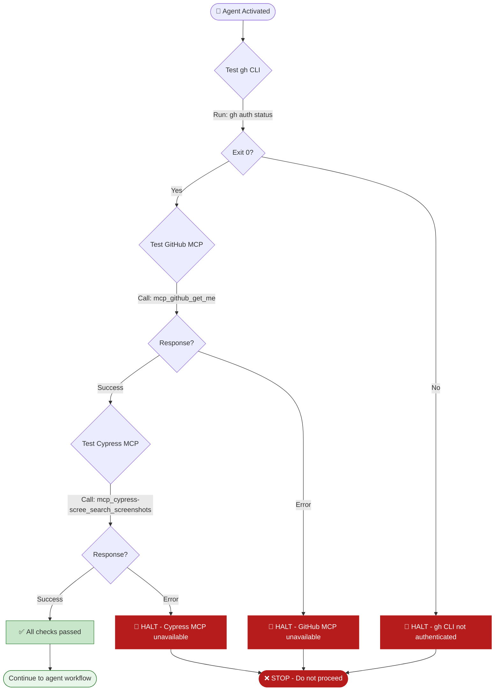

# Environment Guard

**Execute this FIRST before any other agent work. If any check fails → STOP ALL WORK.**

| Check | Command/Tool | Success |
|-------|--------------|---------|
| gh CLI | `gh auth status` | Exit code 0 |
| GitHub MCP | `mcp_github_get_me` | Returns user login |
| Cypress MCP | `mcp_cypress-scree_search_screenshots` | Returns results array |

---

## ⛔ STOP — Execute the flow above and display results before proceeding

| Check | Status | Result |
|-------|--------|--------|
| gh CLI | ✅/❌ | |
| GitHub MCP | ✅/❌ | |
| Cypress MCP | ✅/❌ | |

**All pass → continue. Any fail → HALT and inform user.**

