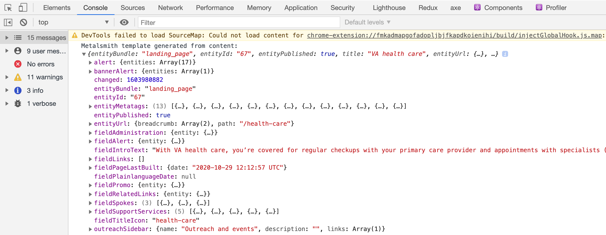
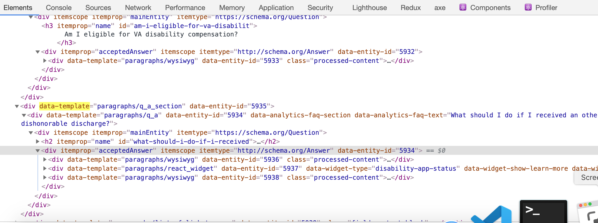
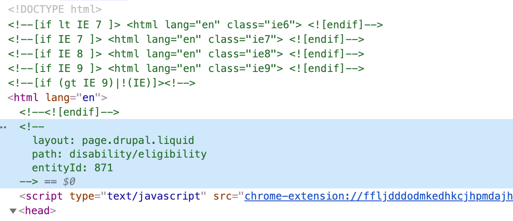

# VA.gov [](http://jenkins.vetsgov-internal/job/testing/job/vets-website/job/master/)

## What is this?

This is the front end repository for VA.gov. It contains application code and templates used across the site.

There are several repositories that contain the code and content used to build VA.gov. If you're looking to get started running VA.gov locally, you should read the [Getting Started](https://department-of-veterans-affairs.github.io/veteran-facing-services-tools/getting-started) documentation.

## Common commands

Once you have the site set up locally, these are some common commands you might find useful:

| I want to... | Then you should... |
| :--- | :--- |
| fetch all dependencies | `yarn install`; run this any time `package.json` changes |
| build both static HTML pages and applications | `yarn build` |
| run the webpack dev server | `yarn watch` |

## Building `vets-website`

The `vets-website` build has two main functions:

1. Build the application assets (JS, CSS)
1. Create the static HTML pages

### Building applications

`vets-website` uses [Webpack](https://webpack.js.org) to bundle application
assets.

To **build all applications**, run the following:

```sh
yarn build:webpack
```

To **recompile your application when you make changes**, run:

```sh
yarn watch
```

You can also **limit the applications Webpack builds** with `--env.entry`:

```sh
yarn watch --env.entry static-pages,auth
```

The `entryname` for your application can be found in its `manifest.json` file.

If you're developing a feature that requires the API, but can't or don't want to
run it locally, you can specify `--env.api`:

```sh
yarn watch --env.api https://dev-api.va.gov
```

**Note:** If you try to log on, ID.me will redirect you to the environment that
the API is set up for. So in the above example, you'd be **redirected back to
dev.va.gov.**

### Building static content

VA.gov contains many pages that include content generated from a Drupal-based content model.
When testing changes to static pages, or to see what your application looks like
on VA.gov, you'll need to build these static pages using the following commands:

```yarn build``` (add ```—pull-drupal``` to get the latest content from production - needs active socks proxy connection)
- run once to pull the latest Drupal content and build the static HTML files
- need to run this again when adding new templates based on new Drupal entities

```yarn watch:content```
- watches for changes to liquid templates or CSS
- separated from ```yarn watch``` because of JS memory issues

```yarn preview```
- You can run this concurrently with `yarn watch`. It adds local routes needed to preview Drupal nodes
(e.g. `/preview?nodeId=XX`).

If you do not have access to the SOCKS proxy, you can **fetch the latest cached version
of the content** with the following:

```sh
yarn fetch-drupal-cache
```

#### How "templating" works
"Templating" refers to the process of data representing website content being compiled into an HTML file.

After setup, the `vagov-content` repo should be a sibling repo to `vets-website`. `vagov-content` contains static content files in the form of Markdown (`.md`) in the `vagov-content/pages` directory. At the top of each Markdown file, there are declarations of key-value pairs referred to as "frontmatter", which are often used to define metadata about the page or to describe how the page should be processed during the HTML compilation.

The most common key in frontmatter is a `layout` property, which refers to a file in `vets-website/src/site/layouts`. For example, this [`layout`](https://github.com/department-of-veterans-affairs/vagov-content/blame/68a9ca3d87214bee2e14a95f54044cd5c7d19f5a/pages/coronavirus-chatbot.md#L3) property refers to this [layout file](https://github.com/department-of-veterans-affairs/vets-website/blob/6c61531163be7b52345b6096dc6a76fc38e7776e/src/site/layouts/page-breadcrumbs.html) in `vets-website`. The frontmatter of the `.md` file are passed to the layout file as the global scope.

<details>

<summary>Example of a Markdown processed throughout a layout file</summary>

For example, pretend this is a `.md` in `vagov-content.`

```markdown
---
layout: favorite-movies.html
movies:
  - Ace Ventura
  - Disney Cars
  - Toy Story
---

I love movies! Here are some of my recommendations.
```

The `layout` property would refer to a layout file `vets-website/src/site/layouts/favorite-movies.html`, which could look like -

```
<p>{{ contents }}</p>
<ul>

  <li>{{ movie }}</li>

</ul>
```

This templating language is called [Liquid](https://shopify.github.io/liquid/). The body of the Markdown file (which resides below the frontmatter of the page and may contain HTML) will be available to the template in a `contents` property. This would result in the following HTML snippet.

```html
<p>I love movies! Here are some of my recommendations.</p>
<ul>
  <li>Ace Ventura</li>
  <li>Disney Cars</li>
  <li>Toy Story</li>
</ul>
```

</details>

##### How templating works with CMS data

After setup, your project should have issued a network request to fetch data from the VA CMS, Drupal. To verify, the response JSON should be located at `vets-website/.cache/localhost/drupal/pages.json`. To refresh the content, run `yarn build:content --pull-drupal`. The `vets-website/.cache` directory will be emptied and a new network request will be issued.

The JSON file returned by the CMS will be parsed into separate pages during the `vets-website` compilation process. Consider opening the `vets-website/.cache/localhost/drupal/pages.json` file to explore the data structures.

<details>

<summary>Example of a Drupal entity processed throughout a layout file</summary>

```json
{
  "entityBundle": "landing_page",
  "entityId": "79",
  "entityPublished": true,
  "title": "VA records",
  "entityUrl": {
    "breadcrumb": [
      {
        "url": {
          "path": "/",
          "routed": true
        },
        "text": "Home"
      },
      {
        "url": {
          "path": "",
          "routed": true
        },
        "text": "Records"
      }
    ],
    "path": "/records"
  },
  "fieldIntroText": "Access your VA records and documents online to more easily manage your benefits."
}
```

Whereas Markdown files contain a clear `layout` declaration in frontmatter, the `entityBundle` is used to form the relationship between a CMS data structure to a layout. The `entityBundle` can be considered a type of CMS "node" represented by this data structure. Layouts used solely by CMS data structures have a unique file extension - `.drupal.liquid`. In this example, the layout file would be `vets-website/src/site/layouts/landing_page.drupal.liquid`.

```
<h1>{{ title }}</h1>
<p>{{ fieldIntroText }}</p>
```

This layout would result in this HTML snippet -

```html
<title>VA records</title>
<p>Access your VA records and documents online to more easily manage your benefits.</p>
```

The `entityUrl.path` property is used to determine the page's path on the website. This example would be visible at `/records/`.

</details>

#### Debugging

<details>

<summary>Console output</summary>

While running your website locally, open the console panel of your browser's developer tools. Visit `/health-care` and observe the following output.



This data structure represents the data structure that was processed throughout the layout file during the website compilation.
</details>

<details>

<summary>DOM attributes</summary>
To further demystify the dynamic nature of the templating process, a pattern of the project is to use `data-` attributes to describe various templates. For example, observe the various `data-template` properties in the following DOM.



There is also an HTML comment at the top of the file to help describe the current page.



</details>

#### Resources

The implementation of the Liquid templating language used by our project is [TinyLiquid](https://github.com/leizongmin/tinyliquid). We highly recommend using [TinyLiquid's README](https://github.com/leizongmin/tinyliquid/blob/cebcb26c3839e725cf0469dccc0073799902a020/README_en.md) as your resource while writing a template, as there are small [differences from Shopify's language spec](https://github.com/leizongmin/tinyliquid#the-difference-with-liquid-language).

### Building both together

CI will build both applications and content with the following:

```sh
yarn build
```

## Running tests

### Unit tests

To **run all unit tests**, use:

```sh
yarn test:unit
```

If you want to **run only one test file**, you can provide the path to it:

```sh
yarn test:unit src/applications/path/to/test-file.unit.spec.js
```

To **run all tests for a folder in src/applications**, you can use app-folder:

```sh
yarn test:unit --app-folder hca
```

To **run all tests in a directory**, you can use a glob pattern:

```sh
yarn test:unit src/applications/path/to/tests/**/*.unit.spec.js*
```

To **run tests with some extra debugging info**, you can pass a log-level:

```sh
yarn test:unit --log-level debug
```

To **run tests with coverage output**, you can pass the coverage option:

```sh
yarn test:unit --coverage
```

For **help with test runner usage**, you can run:

```sh
yarn test:unit --help
```

### End-to-end (E2E) / Browser tests

- E2E or browser tests primarily run in Cypress.
- Some older, existing tests run in Nightwatch, but those are deprecated.

To **open the Cypress test runner UI and run any tests within it**:

```sh
yarn cy:open
```

To **run Cypress tests from the command line**:

```sh
yarn cy:run
```

To **run specific Cypress tests from the command line**:

```sh
# Running one specific test.
yarn cy:run --spec "path/to/test-file.cypress.spec.js"

# Running multiple specific tests.
yarn cy:run --spec "path/to/test-a.cypress.spec.js,path/to/test-b.cypress.spec.js"

# Running tests that match a glob pattern.
yarn cy:run --spec "src/applications/my-app/tests/*"
yarn cy:run --spec "src/applications/my-app/tests/**/*"

# Running tests that match multiple glob patterns.
yarn cy:run --spec "src/applications/a/tests/**/*,src/applications/b/tests/**/*"
```

To **run Cypress tests from the command line on a specific browser**:

```sh
yarn cy:run --headless --browser chrome
yarn cy:run --headless --browser firefox

# Without --headless, the test runner will open and run the test.
yarn cy:run --browser chrome
yarn cy:run --browser firefox
```

**For other options with `yarn cy:run`,** [the same options for `cypress run` are applicable](https://docs.cypress.io/guides/guides/command-line.html#Commands).

To **run Nightwatch tests**, you first need three things:

1. Install the Java JDK on MacOS (if needed):
   ```
   brew update
   brew tap adoptopenjdk/openjdk
   brew cask install adoptopenjdk8
   ```
1. `vets-website` served locally on port 3001
   - You can do this with `yarn watch`
1. `vets-api` to **NOT** be running
   - The browser tests will use a simple mock api on port 3000, but only if
     nothing is already attached to that port

```sh
yarn test:e2e
```

Just like with unit tests, you can also **specify the path to the test file**

```sh
yarn test:e2e src/applications/path/to/test-file.e2e.spec.js
```

## Running a mock API for local development

In separate terminal from your local dev server, run

```sh
yarn mock-api --responses path/to/responses.js
```

See the [mocker-api usage
documentation](https://github.com/jaywcjlove/mocker-api#usage) for how to use
the `responses.js`.

**If you need to log in**, go to your browser dev tools console and enter
`localStorage.setItem('hasSession', true)` and refresh the page. This will then
trigger a `/v0/user` call, which will then get the mocked response of a logged-in
user. (Assuming you've mocked that response, of course.)

Responses to common API requests, such as `/v0/user` and
`/v0/maintenance_windows`, you can use
[`src/platform/testing/local-dev-mock-api/common.js`](src/platform/testing/local-dev-mock-api/common.js)

```javascript
const commonResponses = require('src/platform/testing/local-dev-mock-api/common');

module.exports = {
  ...commonResponses,
  'GET path/to/endpoint': { foo: 'bar' },
};
```

## More commands

After a while, you may run into a less common task. We have a lot of commands
for doing very specific things.

| I want to... | Then you should... |
| :--- | :--- |
| build the production site (dev features disabled). | `NODE_ENV=production yarn build --buildtype vagovprod` |
| fetch the latest content cache from S3 | `yarn fetch-drupal-cache` (does not require SOCKS proxy access) |
| reset local environment (clean out node modules and runs npm install) | `yarn reset:env` |
| run only the app pages on the site for local development without building content. | `yarn watch --env.scaffold` |
| run the site for local development with automatic rebuilding of Javascript and sass **with** css sourcemaps | `yarn watch:css-sourcemaps` then visit `http://localhost:3001/`. You may also set `--env.buildtype` and `NODE_ENV` though setting `NODE_ENV` to production will make incremental builds slow. |
| run the site for local development with automatic rebuilding of code and styles for specific **apps** | `yarn watch --env.entry disability-benefits,static-pages`. Valid application names are in each app's `manifest.json` under `entryName` |
| run the site for local development with automatic rebuilding of code and styles for static **content** | `yarn watch:static` |
| run the site so that devices on your local network can access it | `yarn watch --host 0.0.0.0 --public 198.162.x.x:3001` Note that we use CORS to limit what hosts can access different APIs, so accessing with a `192.168.x.x` address may run into problems |
| run all unit tests and watch | `yarn test:watch` |
| run only e2e tests | Make sure the site is running locally (`yarn watch`) and run the tests with `yarn test:e2e` |
| run e2e tests in headless mode | `yarn test:e2e:headless` |
| run all linters | `yarn lint` |
| run only javascript linter | `yarn lint:js` |
| run only sass linter | `yarn lint:sass` |
| run lint on JS and fix anything that changed | `yarn lint:js:changed:fix` |
| run automated accessibility tests | `yarn build && yarn test:accessibility` |
| run visual regression testing | Start the site. Generate your baseline image set using `yarn test:visual:baseline`. Make your changes. Then run `yarn test:visual`. |
| test for broken links | Build the site. Broken Link Checking is done via a Metalsmith plugin during build. Note that it only runs on _build_ not watch. |
| add new npm modules | `yarn add my-module`. Use the `--dev` flag for modules that are build or test related. |
| get the latest json schema | `yarn update:schema`. This updates our [vets-json-schema](https://github.com/department-of-veterans-affairs/vets-json-schema) vets-json-schema https://github.com/department-of-veterans-affairs/ to the most recent commit. |
| check test coverage | `yarn test:coverage` |
| run bundle analyzer on our production JS bundles | `yarn build-analyze` |
| generate a stats file for analysis by bundle analyzer | `NODE_ENV=production yarn build:webpack --env.buildtype=vagovprod --env.analyzer`. Note that if you get an error like `FetchError: request to http://prod.cms.va.gov/graphql failed` you need to be on the SOCKS proxy |
| load the analyzer tool on a stats file | `yarn analyze` |
| add a new React app | `yarn new:app` (make sure you have [`vagov-content`](https://github.com/department-of-veterans-affairs/vagov-content/) sibling to `vets-website`) |

## Supported Browsers

| Browser | Minimum version | Note |
| :--- | :---: | :--- |
| Internet Explorer | 11 | |
| Microsoft Edge | 13 | |
| Safari / iOS Safari | 9 | |
| Chrome / Android Web view | 44 | _Latest version with >0.5% of traffic_ |
| Firefox | 52 | _Latest version with >0.5% of traffic_ |

## Additional Resources

1. [VA.gov Knowledge Hub](https://department-of-veterans-affairs.github.io/va.gov-team/)
1. [Docs Directory](./docs)
1. [Manual](https://github.com/department-of-veterans-affairs/va.gov-team/blob/master/platform/accessibility/testing/508-manual-testing.md) and [Automated](https://github.com/department-of-veterans-affairs/va.gov-team/blob/master/platform/accessibility/testing/508-automated-testing.md) 508 Testing
