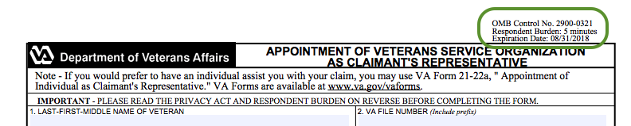

# vets-website Yeoman generator

We have a Yeoman generator for starting up new React applications in vets-website. This page will guide you through setting up the generator and explaining the questions that are asked as part of the setup process.

## Getting Started

To install the generator, you'll need to do the following:

```bash
npm install -g yo
npm install -g @department-of-veterans-affairs/generator-vets-website
```

Once you have that set up, navigate to the root of the vets-website repository and run:

```bash
yo @department-of-veterans-affairs/vets-website
```

## Generating an application

After running the above command, the generator will start up and ask you a series of questions:

### What's the name of your application?

This value will be used as the page title. If you're creating a form, it will also be used as the header for the introduction page and as a header on the confirmation page.

### What folder in src/applications should your app live in?

Most of our React applications have their own folder in src/applications, so normally you want to pick a new folder. However, if you're building an application that's related to other applications, there may be a folder that your app should go in. An example would be if you were creating a new education form, you would probably create your app in edu-benefits/newform.

### What should be the name of your app's entry bundle?

This is the name of the bundle that Webpack builds for your application. They're normally lower case with dashes separating words. This is primarily used to link your bundle to the content page that is created as a base for your application. It doesn't show up in your code anywhere. It's also separate from the entry file.

### What's the root url for this app?

This is the url your application will live at. In your React apps you will likely have multiple pages and the urls for those pages will have this as the base. This value also gets translated into the page for the content page, which lives in `content/pages`.

### Is this a form app?

If this is a form, there are some more questions after this step. If not, you're done!

### What's your form number?

This is the form number for the paper form you're converting. Normally it's something like 22-1990 or 21-22. This is used in a couple places in the UI and also as a key for the save in progress functionality of our forms.

### What's the Google Analytics event prefix you want to use?

Our shared form code sends events to Google Analytics and we need a unique prefix to be able to categorize the events by form. It's normally a dash separated value like `hca-` or `edu-1990-` and is made up by developers.

### What's the respondent burden of this form in minutes?

Each paper form has OMB information that lives in the margins of each page (usually in the top right):



This is the respondent burden value from that information. All the information from this question and the next two can be found in the props for the `OMBInfo` component in `containers/IntroductionPage.jsx`, if you need to change it later.

### What's the OMB control number for this form?

Similarly to the last question, this is more information from the OMB data, which lives in the margins of the pages of the paper form.

### What's the OMB expiration date for this form?

Again similarly to the last question, this is more information from the OMB data, which lives in the margins of the pages of the paper form.

### What's the benefit description for this form?

This question is a bit more nebulous. We have a description of the type of benefits that you would be getting by using this form. Other examples are "health care benefits" and "veteran id card."

## You're done!

Once you've answered all those questions, you're done and the generator will create the files for you. To see them in your local development environment, you'll need to build again or restart the watch task you have running.
