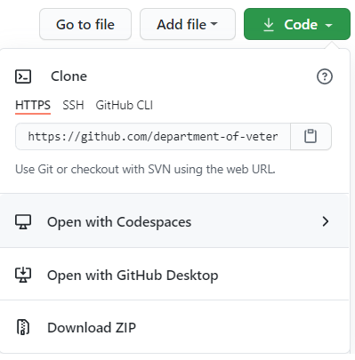
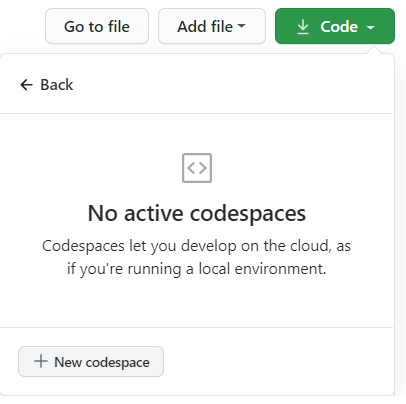
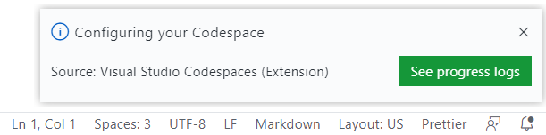
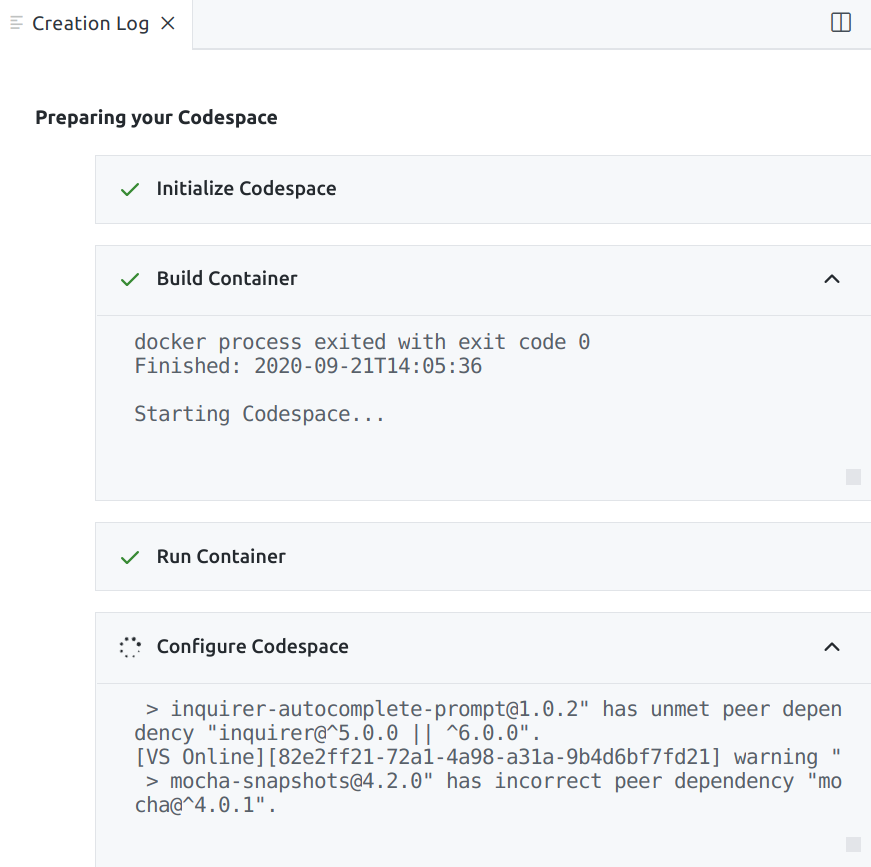
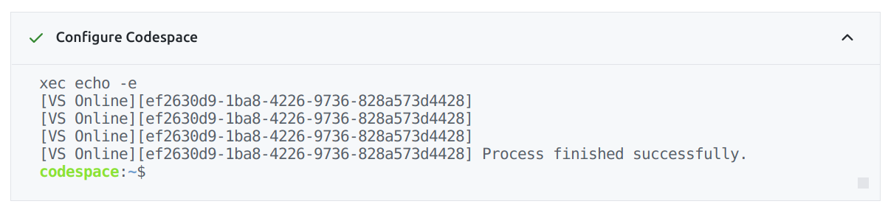

# Github Codespaces

## Introduction

Github Codespaces provide an Integrated Development Environment (IDE) that is accessible entirely in a web browser. It is essentially a web based version of [VS Code ](https://code.visualstudio.com/) running on a cloud based virtual machine.

Codespaces is [currently in beta](https://github.com/features/codespaces) and VA users have been given early access to test.

If you are interested in helping test Codespaces please [sign up here](https://github.com/department-of-veterans-affairs/github-user-requests/issues/new?assignees=&labels=general+issue%2C+user-created&template=general-help-request.md&title=Add%20user%20to%20Codespaces) and join [#codespaces](https://dsva.slack.com/archives/C01AN96U39V).

Note: Support for Codespaces is a work in progress. During the beta all Codespaces are free, but restricted to medium size and can be slow. Codespaces auto pause after 30 min of inactivity, and there is a limit of 2 Codespaces per user.

[Codespaces Documentation](https://docs.github.com/en/github/developing-online-with-codespaces/about-codespaces)

## Getting Started

1. Visit `vets-website` [Github repository](https://github.com/department-of-veterans-affairs/vets-website)

1. Click green "Code" button and select "Open with Codespaces"

   ||
   |-|

1. If this is your first time using Codespaces select "New codespace"

   ||
   |-|
   
1. On initial creation the Codespace will perform these actions:

   - Configure Node, NPM, NVM, and Yarn
   - Install dependencies
   - Download `vagov-content` repo
   - Download Drupal cache
   - See `/.devcontainer/post-create.sh` for full script

1. Click notifications (bell icon in bottom right corner) and "See progress logs" to view status. There is also a VS Code command: `>Codespaces: View Creation Log`

   ||
   |-|

1. While setup is in process the "Configure Codespace" step will be active.
   
   ||
   |-|

1. Once setup is complete the "Configure Codespace" still will show as complete.
   
   ||
   |-|

   *Full logs are available at `~/post-create.log`*

1. Start the development server
   - Open terminal
   - Run command:

      `yarn watch`
   - Ctrl + click on localhost link in terminal to open webserver in new tab

## Customization

### Settings sync

- Click on user icon in lower left hand corner and select "Turn on settings sync"
- Select your Github username
- User settings will be synchronized to `~/.vscode/settings.json` and will override any container or workspace settings.
