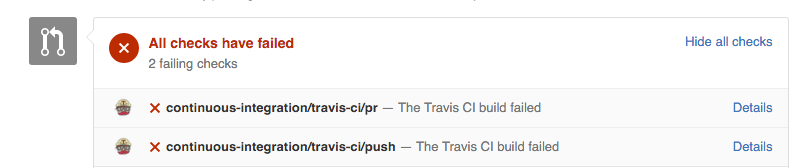
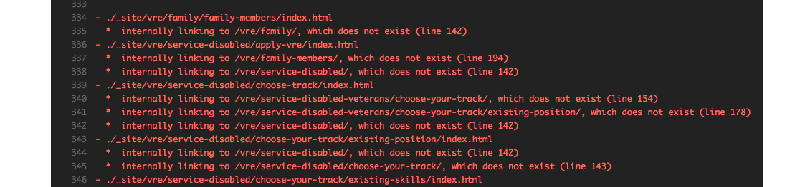

# Why Is My Build Breaking?

Breaking the Travis CI build is pretty easy to do and also pretty common. Never
fear! It is also easy to fix.

## Finding out why the build is failing

Each pull request page indicates whether your commits have errors that break the build.

Next to the failing build message is a _Details_ link. Click it to find out what's causing the failure. It will take you to a page at Travis-CI.org. Scroll down that page until you see a bunch of red text.

This will indicate what error, what file, and what line is causing a problem. **Note:** _The exact error text will vary depending on which language you are using_. 

#### A gotcha for content:

If you are adding content via Markdown files, HTML-Proofer will report errors in the _generated HTML files_. You'll need to fix the error in the corresponding Markdown file.

## Why might a build break?

Common causes of a failing build are HTML markup errors, HTML entity errors, and 
broken links. Below are some common error messages, their causes, and their fixes.

| If you see an error like this&#8230; | It's probably caused by&#8230; | To fix, do&#8230;
-------------------
| `Unexpected end tag` | Mismatched tags. Either the end tag is wrong (e.g. `&lt;h4&gt;Heading&lt;/h6&gt;`), or the start tag is missing altogether. (e.g. `Heading&lt;/h6&gt;`) | Check the corresponding Markdown file for that HTML page. | 
| `htmlParseEntityRef: expecting ';'` | An unescaped character. Some characters need to be escaped in HTML using a _named character reference_. Such characters include `&`, `>`, `"` and `<`. | Use an [named character reference](https://html.spec.whatwg.org/multipage/syntax.html#named-character-references) for the character in question. |
| `*  internally linking to` [path]`, which does not exist` | Either there's (a) an explicit link to the wrong file, or (b) a generated breadcrumb link points to a page that doesn't exist. | If (a), fix your URLs to point to the right page. If (b), update your directory structure. See [How URLs are Created](HowURLsAreCreated.md) for more.
 