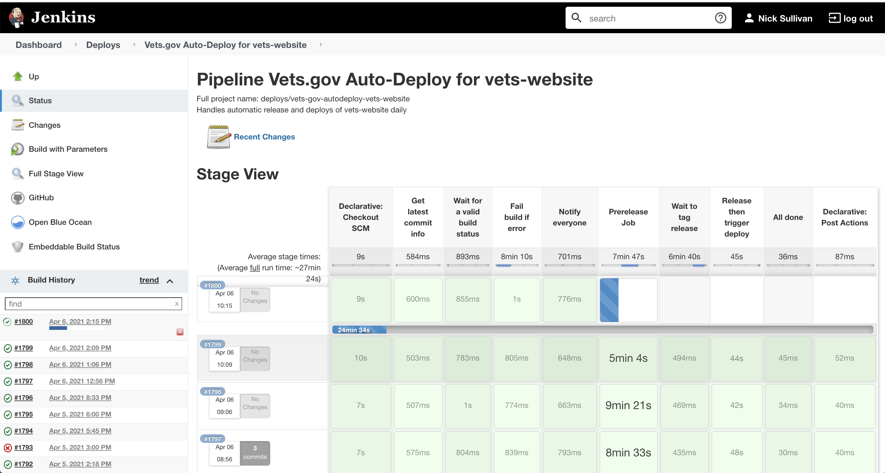
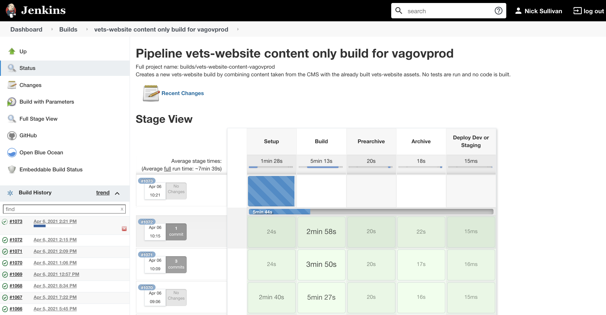
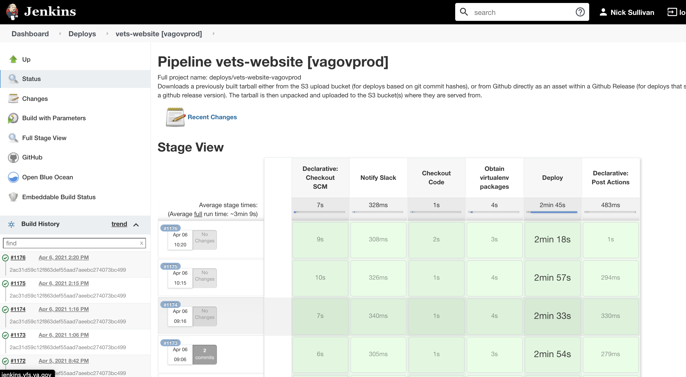

# CMS integration into the front-end website

## Table of contents
1. Content release - the process as a whole
2. Content build
3. Content data used beyond templating
    - React widgets
    - MegaMenu JSON (in-page and .json file)
    - Find Forms + Form Detail pages
    - Resources

## Summary of the Content Release process
A _Content Release_ describes the entire process behind refreshing content on the website to reflect the content as stored in the CMS. The process begins after a CMS editor manually initiates it through a control in the CMS, when an engineer initiates it through a specific Jenkins job, or after being initiated automatically by a scheduled job. The process is complete once content on the website is visibly up-to-date with that in the CMS.

The Jenkins job behind a Content Release is the same job that is executed during the vets-website full-code Release, widely referred to as the "daily deployment." This Jenkins job is the [`Vets.gov Auto-Deploy for vets-website`](http://jenkins.vfs.va.gov/job/deploys/job/vets-gov-autodeploy-vets-website/), or just the _Auto-Deploy_.

The Auto-Deploy dashboard in Jenkins

A step inside of the Auto-Deploy, its column labeled in the Auto-Deploy dashboard as `Prerelease Job`, issues a separate job and waits for that job to complete. This separate job is the [`vets-website content only build`](http://jenkins.vfs.va.gov/job/builds/job/vets-website-content-vagovprod/). This is commonly referred to as the _Content Build_, which is an execution of the vets-website static site generator. The result of this process is an updated version of the website uploaded to the cloud as a compressed directory of static HTML, CSS, JavaScript, and other static files - this compressed file is referred to as an "archive."

The vets-website Content Only Build dashboard in Jenkins

This job is executed synchronously during the `Prerelease Job` in the Auto-Deploy.

Towards the end of the pipeline, the Auto-Deploy issues another separate job under the column labeled `Release then trigger deploy`. This separate job is the [`vagovprod`](http://jenkins.vfs.va.gov/job/deploys/job/vets-website-vagovprod/), which actually populates the va.gov domain server with the contents of the archive. This job is executed asynchronously, which means it isn't well-reflected in the Auto-Deploy dashboard because the Auto-Deploy will complete before Vagovprod is finished. However, as a Content Release is finished only after content is visibly refreshed on va.gov, it is part of the Content Release as a whole. The `vagovprod` job takes roughly three minutes.

The Vagovprod dashboard in Jenkins

This job is executed asynchronously during the `Release then trigger deploy` job in the Auto-Deploy.

### Content Release vs. the Daily Deployment (Full-code Release)

## Content build

## Content data used beyond templating
