# Available ui:fields
**Table of Contents**

- [`ObjectField`](#objectfield)
    - [`uiSchema` options](#uischema-options)
        - [`ui:description`](#uidescription)
        - [`ui:options`](#uioptions)
            - [`expandUnder`](#expandunder)
            - [`expandUnderClassNames`](#expandunderclassnames)
            - [`showFieldLabel`](#showfieldlabel)
            - [`classNames`](#classnames)
        - [`ui:order`](#uiorder)
        - [`ui:title`](#uititle)
    - [`schema` options](#schema-options)
        - [`ui:collapsed`](#uicollapsed)
        - [`title`](#title)
        - [`ui:hidden`](#uihidden)
        
<!-- TODO: Document the `FieldTemplate` options; possibly in another reference -->
<!-- section since it's not really a field or widget -->

## `ObjectField`
This is the default field for `type: 'object'` schemas.

### `uiSchema` options
#### `ui:description`
**Type:** `string`, React component

Describe the fields in more detail than a title can convey. Often, objects will
have a `ui:description` without a `ui:title`.

**Example: `string`**
```js
const schema = {
  type: 'object',
  properties: {
    field1: { type: 'string' },
  },
};

const uiSchema = {
  'ui:description':
    "The ui:description shows here. It's frequently used to display long-form text describing what the page is asking for.",
  field1: {
    'ui:title': 'First field',
  },
};
```
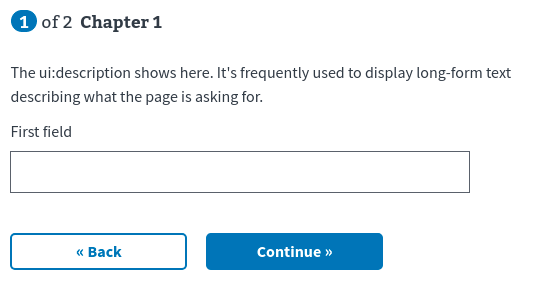

**React component props:**
- `formContext`: `object`
  - Contains information about the page
  - **TODO:** Document this in a separate place and link to it here
- `formData`: `object`
  - The user data gathered by the form
- `options`: `object`
  - The entire `ui:options` object used by the `ObjectField`

**Example: React component**
```jsx
const CustomDescription = ({ formData, options }) => (
  <div>
    This is a custom description. The first field contains '{formData.field1}
    ', and the pointless ui:option value in the uiSchema is '{options.pointless}
    '.
  </div>
);

const schema = {
  type: 'object',
  properties: {
    field1: { type: 'string' },
  },
};

const uiSchema = {
  'ui:description': CustomDescription,
  'ui:options': {
    pointless:
      'This value is not used by the forms library, but is passed to the custom description component',
  },
  field1: {
    'ui:title': 'First field',
  },
};
```
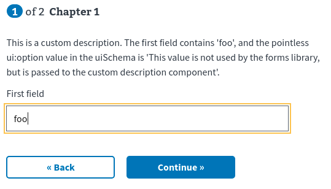

#### `ui:options`
<!-- TODO: Describe this--why it's a separate section in uiSchema -->

##### `expandUnder`
**Type:** `string`

Show some fields only if the field referenced by `expandUnder` is truthy.
`expandUnder` must be the name of a field on the page.

**Example:**
```js
const schema = {
  type: 'object',
  properties: {
    field1: { type: 'boolean' },
    optionalQuestions: {
      type: 'object',
      properties: {
        field1: { type: 'string' },
        field2: { type: 'string' },
      },
    },
    field2: { type: 'boolean' },
    nestedInput: { type: 'string' },
  },
};

const uiSchema = {
  field1: {
    'ui:title': 'Expand the nested fields?',
  },
  optionalQuestions: {
    'ui:options': {
      expandUnder: 'field1',
    },
  },
  field2: {
    'ui:title': 'Expand a single nested field?',
  },
  nestedInput: {
    'ui:options': {
      expandUnder: 'field2',
    },
  },
};

```

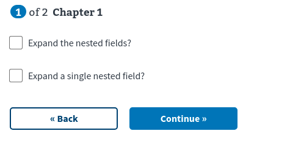
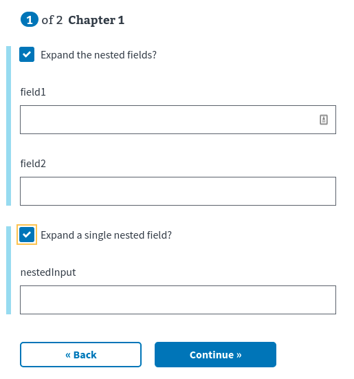

##### `expandUnderClassNames`
**Type:** `string`

Apply an HTML class to the expanded fields.

> **Note:** This must be put on the **target** of `expandUnder`, not the fields to
> be expanded.

**Example:**
```js
const schema = {
  type: 'object',
  properties: {
    field1: { type: 'boolean' },
    nestedInput: { type: 'string' },
  },
};

const uiSchema = {
  field1: {
    'ui:title': 'Expand a single nested field?',
    'ui:options': {
      expandUnderClassNames: 'foo',
    },
  },
  nestedInput: {
    'ui:options': {
      expandUnder: 'field1',
    },
  },
};
```

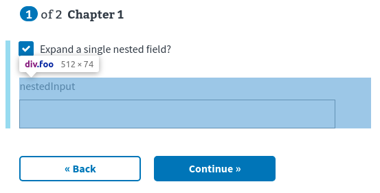

##### `showFieldLabel`
**Type:** `bool`, `string` (`'label'` is the only meaningful string)

<!-- TODO: Link to the `FieldTemplate` docs for showFieldLabel -->

If `showFieldLabel` is falsey, `ObjectField` renders the `ui:title`. If this is
truthy, `FieldTemplate` will render the `ui:title` and `ui:description`. The
`ui:title` will be a
- `<legend>` if truthy
- `<label>` if `'label'`

In the following examples, take note of two things:
- What the `ObjectField` is rendering (everything else is rendered by the `FieldTemplate`)
- What the `ui:title`'s DOM element is
  - `legend` vs `label`

**Example: `false` or `undefined`**
```js
const schema = {
  type: 'object',
  properties: {
    field1: { type: 'string' },
  },
};

const uiSchema = {
  'ui:title': 'The title for the whole object',
  'ui:description': 'Some description for the object goes here.',
};
```
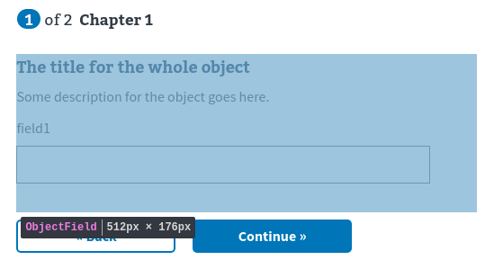

**Example: `true`**
```js
const schema = {
  type: 'object',
  properties: {
    field1: { type: 'string' },
  },
};

const uiSchema = {
  'ui:title': 'The title for the whole object',
  'ui:description': 'Some description for the object goes here.',
  'ui:options': {
    showFieldLabel: true,
  },
};
```
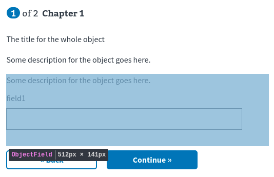
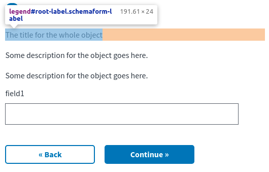

**Example: `'label'`**
```js
const schema = {
  type: 'object',
  properties: {
    field1: { type: 'string' },
  },
};

const uiSchema = {
  'ui:title': 'The title for the whole object',
  'ui:description': 'Some description for the object goes here.',
  'ui:options': {
    showFieldLabel: 'label',
  },
};
```
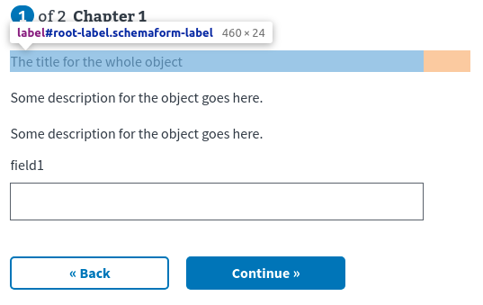

##### `classNames`
#### `ui:order`

#### `ui:title`
**Type:** `string`, React component

Display a title for the whole object.

**Example: `string`**
```js
const schema = {
  type: 'object',
  properties: {
    field1: { type: 'string' },
  },
};

const uiSchema = {
  'ui:title': 'Title for the object',
  field1: {
    'ui:title': 'The first field',
  },
};
```

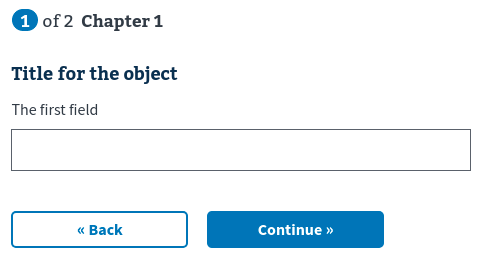

**React component props:**
- `id`: `string`
  - The ID for the title field
  - This will match the `id` for the input it's associated with, appended with `__title`
  - In the example below, the `id` passed to `CustomTitleComponent` is
  `root__title` because the object its on is the root of the schema
- `formContext`: `object`
  - Contains information about the page
  - **TODO:** Document this in a separate place and link to it here
- `formData`: `object`
  - The user data gathered by the form
- `required`: `bool`
  - Whether the field is required or not

**Example: React component**
```jsx
const CustomTitleComponent = ({ id, formData, required }) => (
  <h2 id={id}>
    {formData.field1}
    {required && '*'}
  </h2>
);

const schema = {
  type: 'object',
  properties: {
    field1: { type: 'string' },
  },
};

const uiSchema = {
  'ui:title': CustomTitleComponent,
  field1: {
    'ui:title': 'The contents of this field change the object label',
  },
};
```
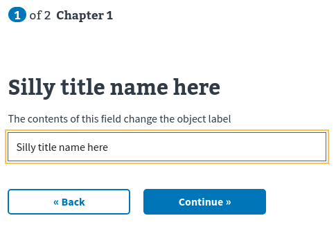

### `schema` options
While most UI configuration is held in the `uiSchema`, the `ObjectField` has a
few options.

<!-- TODO: Change this into a warning box if possible -->
> **You'll almost never want to manually set these options in your
> `schema`.** Internal functions will modify the schema to add and remove these
> properties as needed. This reference makes mention of these only for the sake
> of completeness.


#### `title`
**Type:** `string`, React component

See [`ui:title`](#uititle) for usage; it's the same.

If a field in the object has both a `title` in the schema **and** a `ui:title`
in the `uiSchema`, the `ui:title` will be used.

#### `ui:collapsed`
Used by `hideIf`?

#### `ui:hidden`
**Type:** `bool`

When `ui:hidden` is added to the `schema` (**NOT** `uiSchema`) for an object's
property, it's not rendered in the form.

**Example**
```js
const schema = {
  type: 'object',
  properties: {
    field1: {
      type: 'string',
      'ui:hidden': true,
    },
    field2: { type: 'string' },
  },
};
```

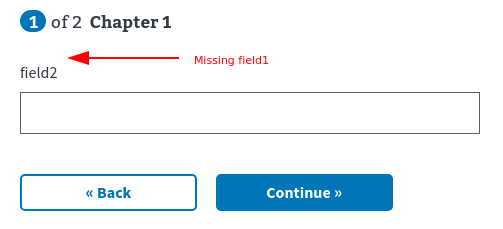
