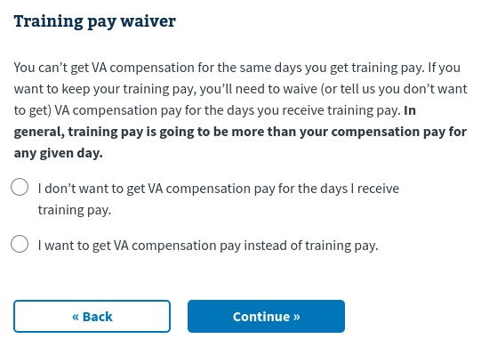

# Available ui:widgets


**Table of Contents**

- [`CheckboxWidget`](#checkboxwidget)
- [`DateWidget`](#datewidget)
- [`EmailWidget`](#emailwidget)
- [`RadioWidget`](#radiowidget)
- [`SelectWidget`](#selectwidget)
- [`TextWidget`](#textwidget)
    - [`uiSchema` options](#uischema-options)
        - [`ui:options`](#uioptions)
            - [`autocomplete`](#autocomplete)
            - [`inputType`](#inputtype)
            - [`widgetClassNames`](#widgetclassnames)
    - [`schema` options](#schema-options)
        - [`maxLength`](#maxlength)
- [`TextareaWidget`](#textareawidget)
- [`YesNoWidget`](#yesnowidget)
    - [`uiSchema` options](#uischema-options-1)
        - [`ui:options`](#uioptions-1)
            - [`labels`](#labels)
            - [`yesNoReverse`](#yesnoreverse)

## `CheckboxWidget`
**`ui:widget` key:** `checkbox`

## `DateWidget`
**`ui:widget` key:** `date`

## `EmailWidget`
**`ui:widget` key:** `email`

## `RadioWidget`
**`ui:widget` key:** `radio`

## `SelectWidget`
**`ui:widget` key:** `select`

## `TextWidget`
**`ui:widget` key:** `text`

Render an `<input>` element to the DOM.

**Compatible schema types:** `string`, `number`

**Default for schema types:** `string`, `number`

<details>
<summary>Example: <code>string</code></summary>

```js
const schema = {
  type: 'object',
  properties: {
    field1: { type: 'string' },
  },
};
```

</details>

<details>
<summary>Example: <code>number</code></summary>

```js
const schema = {
  type: 'object',
  properties: {
    field1: { type: 'number' },
  },
};
```

</details>

### `uiSchema` options
#### `ui:options`
##### `autocomplete`
**Type:** `string`

Set the [`autocomplete`](https://developer.mozilla.org/en-US/docs/Web/HTML/Attributes/autocomplete)
on the `<input>` DOM element.

<details>
<summary>Example</summary>

```js
const schema = {
  type: 'object',
  properties: {
    field1: { type: 'string' },
  },
};

const uiSchema = {
  field1: {
    'ui:options': {
      autocomplete: 'on',
    },
  },
};
```

Produces the following HTML:

```html
<input autocomplete="on" type="text" id="root_field1" name="root_field1" value="">
```
</details>

##### `inputType`
**Type:** `string`

Change the [`type`](https://developer.mozilla.org/en-US/docs/Web/HTML/Element/input#attr-type)
of the `<input>` DOM element. See [`<input>`
types](https://developer.mozilla.org/en-US/docs/Web/HTML/Element/input#<input>_types)
for a list of available types.

> **Note:** Rather than change the `inputType` to `'email'` and `'date'`, it's
> better to use [`'ui:widget': 'email'`](#emailwidget) and [`'ui:widget':
> 'date'`](#datewidget) respectively.

<details>
<summary>Example</summary>

```js
const schema = {
  type: 'object',
  properties: {
    field1: { type: 'string' },
  },
};

const uiSchema = {
  field1: {
    'ui:options': {
      inputType: 'password',
    },
  },
};
```

</details>

##### `widgetClassNames`
**Type:** `string`

Specify the class names for the `<input>` DOM element.

<details>
<summary>Example/summary>

```js
const schema = {
  type: 'object',
  properties: {
    field1: { type: 'string' },
  },
};

const uiSchema = {
  field1: {
    'ui:options': {
      widgetClassNames: 'foo',
    },
  },
};
```

</details>

### `schema` options

#### `maxLength`

**Type:** `number`

Set the `maxlength` on the `<intput>` DOM element.

<details>
<summary>Example/summary>

```js
const schema = {
  type: 'object',
  properties: {
    field1: {
      type: 'string',
      maxLength: 3,
    },
  },
};
```

</details>

## `TextareaWidget`
**`ui:widget` key:** `textarea`

## `YesNoWidget`
**`ui:widget` key:** `yesNo`

Render "Yes" and "No" radio buttons. Selecting "Yes" sets the field data to
`true` and "No" sets it to `false`.

**Compatible schema types:** `boolean`

**Default for schema types:** None

<details>
<summary>Example/summary>

```js
const schema = {
  type: 'object',
  properties: {
    field1: { type: 'boolean' },
  },
};

const uiSchema = {
  field1: {
    'ui:widget': 'yesNo',
  },
};
```

</details>

### `uiSchema` options
#### `ui:options`
##### `labels`
**Type:** `object`

**Shape:**
```js
{
  Y: string,
  N: string
}
```

Change the labels for the "Yes" and "No" options.

<details>
<summary>Example/summary>

```js
const schema = {
  type: 'object',
  properties: {
    field1: { type: 'boolean' },
  },
};

const uiSchema = {
  field1: {
    'ui:widget': 'yesNo',
    'ui:options': {
      labels: {
        Y: 'Alternative label for Yes',
        N: 'Alternative label for No',
      },
    },
  },
};
```

</details>

##### `yesNoReverse`
**Type:** `boolean`

If `yesNoReverse` is `true`, selecting "Yes" sets the field data to `false`, and
"No" sets it to `true`,

<details>
<summary>Example/summary>

```js
const schema = {
  type: 'object',
  properties: {
    field1: { type: 'boolean' },
  },
};

const uiSchema = {
  field1: {
    'ui:widget': 'yesNo',
    'ui:options': { yesNoReverse: true },
  },
};
```

</details>

To get an idea of when this would be appropriate, see the following example from
the 21-526EZ All Claims form:

<details>
<summary>Example/summary>

```jsx
const waiveTrainingPayDescription = (
  <p>
    You can’t get VA compensation for the same days you get training pay. If you
    want to keep your training pay, you’ll need to waive (or tell us you don’t
    want to get) VA compensation pay for the days you receive training pay.{' '}
    <strong>
      In general, training pay is going to be more than your compensation pay
      for any given day.
    </strong>
  </p>
);

const schema = {
  type: 'object',
  properties: {
    waiveTrainingPay: { type: 'boolean' },
  },
};

const uiSchema = {
  'ui:title': 'Training pay waiver',
  waiveTrainingPay: {
    'ui:title': ' ',
    'ui:description': waiveTrainingPayDescription,
    'ui:widget': 'yesNo',
    'ui:options': {
      yesNoReverse: true,
      labels: {
        Y:
          'I don’t want to get VA compensation pay for the days I receive training pay.',
        N: 'I want to get VA compensation pay instead of training pay.',
      },
    },
  },
};
```


</details>
