# Careers and Employment

- **Main page**
  - Uses both card and list navigation, not clear why

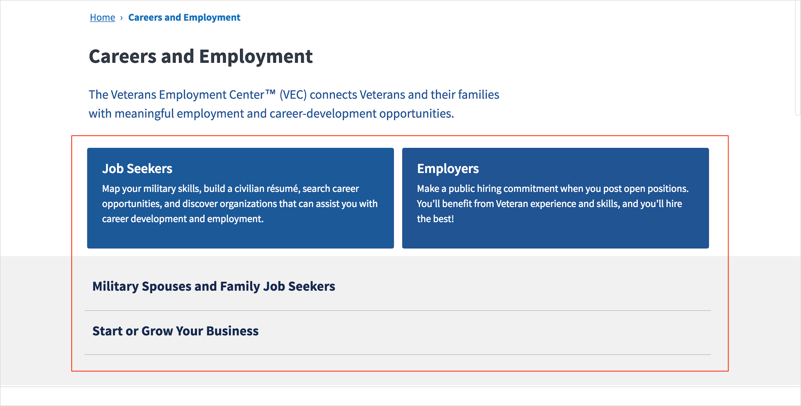

### Job seekers

- **Less than one year**
  - Callout box headings shouldn't be bulleted

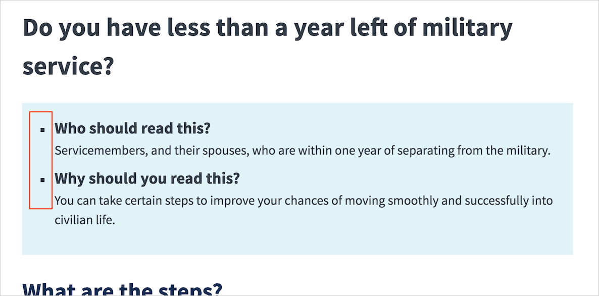

- **Skills translator**
  - Error message style is not US web design standard

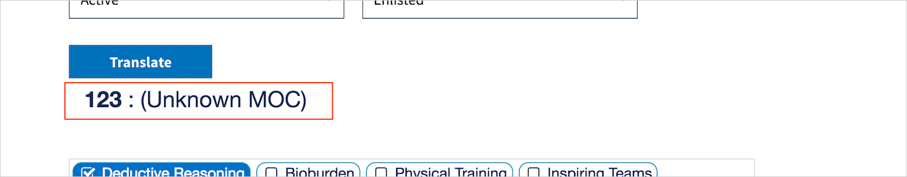

  - Consider vertical columns for the skills list, easier to scan
  - Rounded checkbox containers in skills list feel off-brand

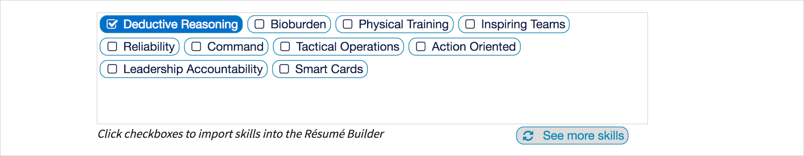

  - "Import into Résumé Builder" button color is not the default green

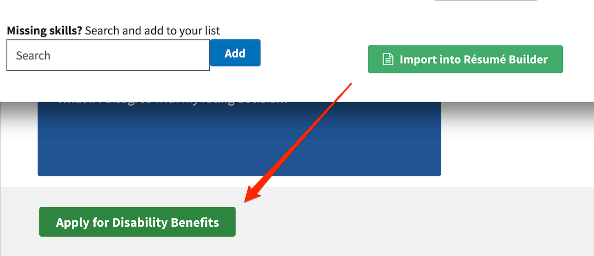

- **Résumé Builder**
  - Column width is wider than standard

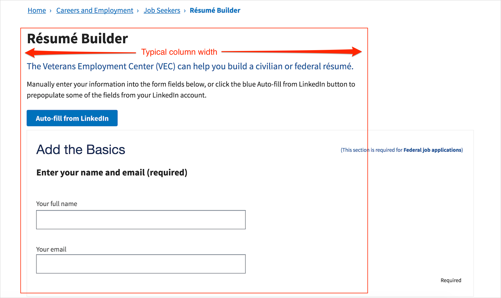

  - Visible boxes encompassing sections haven't been used before - consider instead using HRs or Process List pattern to denote sections

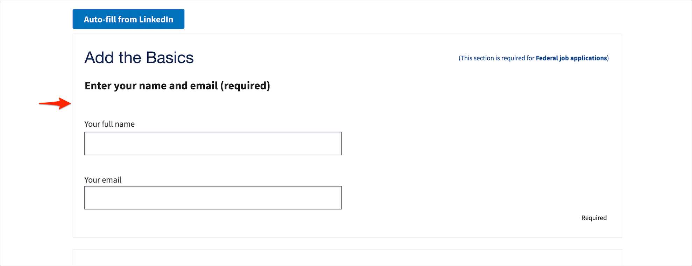

  - Error message style is not US web design standard

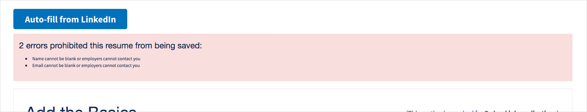

  - Preview
    - Grey background feels off-brand
    - Mobile - "Edit Résumé" CTA button positioned below my name is odd, should be outside of the résumé preview area

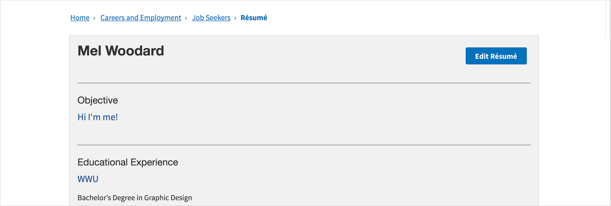

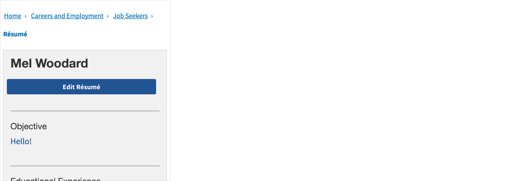

- **Federal Employment**
  - Additional information below the eligibility text should be included in the callout box

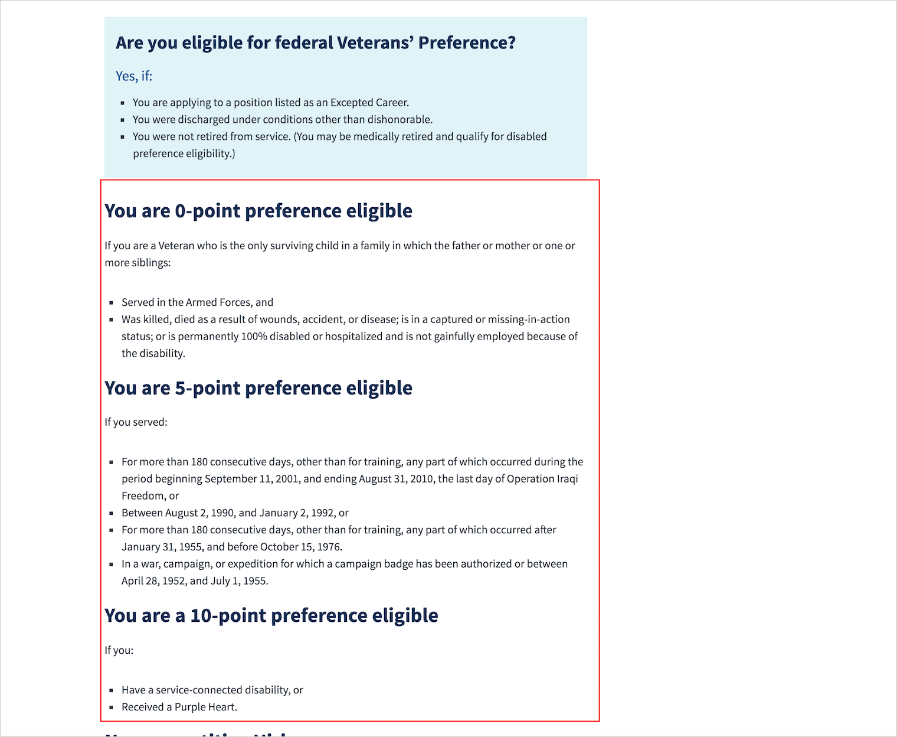

- **Service-Disabled Vets**
  - Secondary heading styles aren't consistent with other parts of the site

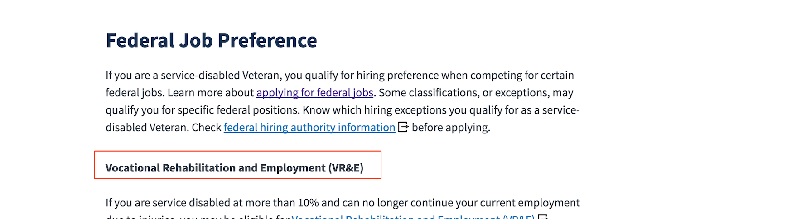

- **Job Search**
  - Hitting search button w/ empty fields doesn't do anything and doesn't give me an error message

### Employers

- **Main page**
  - "Learn more" section header not styled correctly

- **Commitments**
  - Table border styles aren't US web design standard thickness / color
  - Column widths aren't ideal for the content

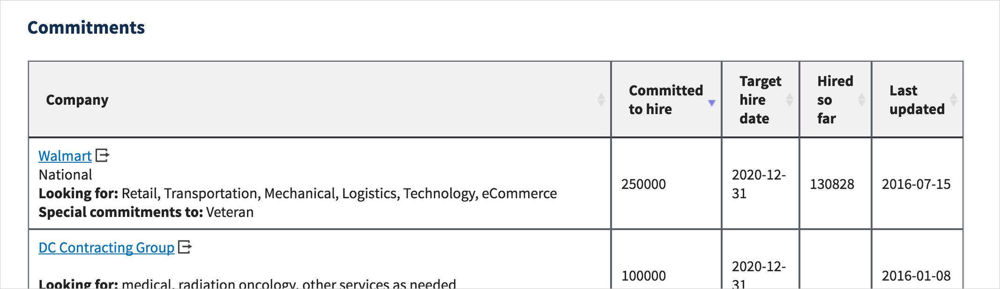
