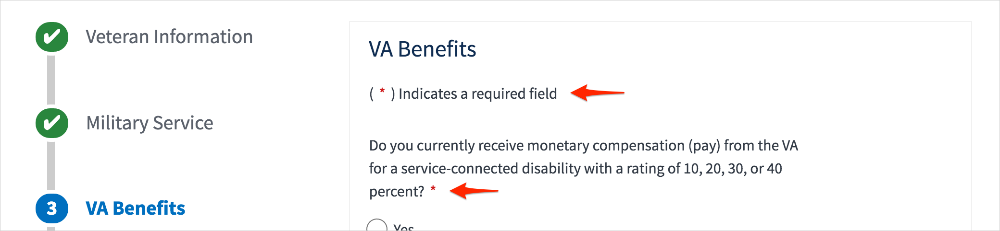
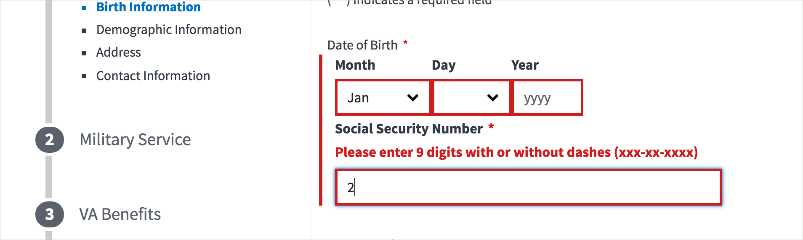
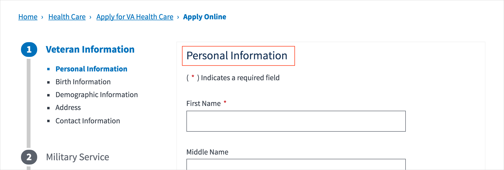
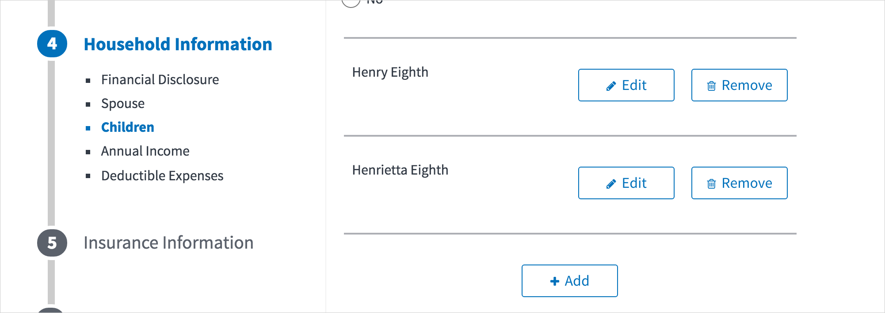
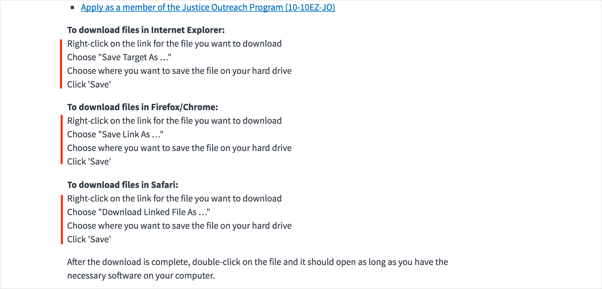
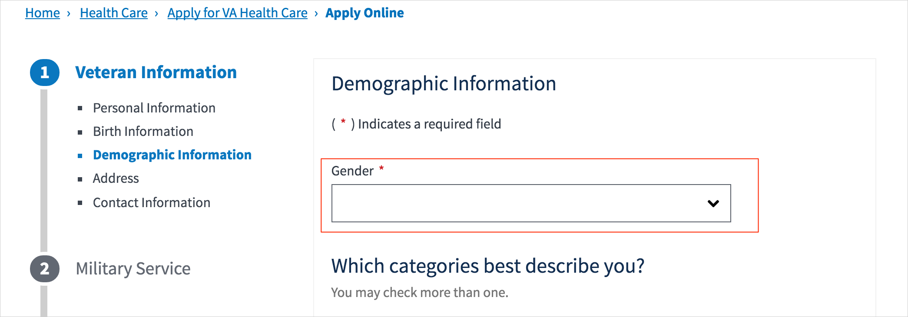
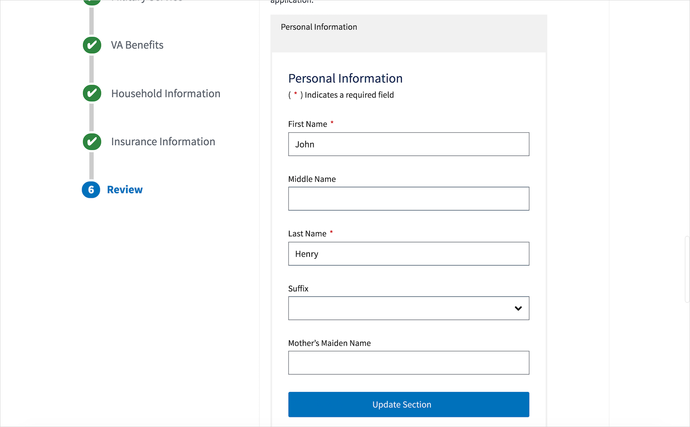

# Apply for VA Health Care

### General Themes

- **Required fields**
  - US web design standards recommends only labeling *optional* fields instead of labeling the required ones

- **Error validation**
  - On fields that are validated for a specific format like birthdate and SSN, I get an error before I've finished entering them - error check shouldn't happen until I click "Continue"

- **Heading text styles**
  - Uses a lighter font weight inconsistent with main headings in the rest of the site - 

- **Buttons**
  - Buttons with icons + text aren't seen elsewhere on vets.gov - evaluate whether this pattern can/should scale to other sections of the site

### Landing Page

- Eligibility information should be in a callout box 

- Form download instructions should be in bullet points for easier scanning

- "Notes" heading style with double-asterisk isn't seen elsewhere

### Application Fields

- Radio buttons should be used instead of dropdowns whenever there's a small range of available options, like gender:

### Review

- Review sections are an off-brand version of the US web standard accordion component
- "Update Section" button spans the full column width - this isn't seen anywhere else at desktop breakpoints

### Mobile

- The process list of steps in the application is completely hidden on mobile, so I have no idea where I am in the process.
