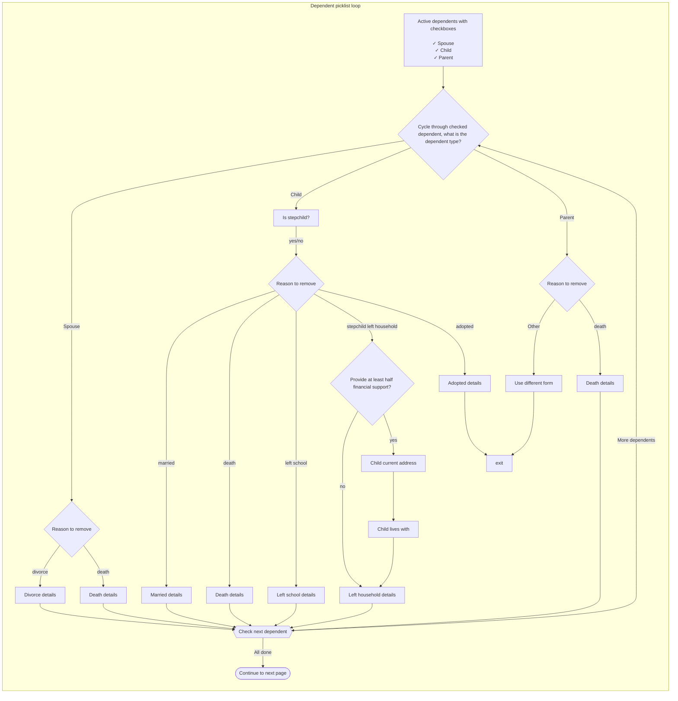

# Picklist

## Why is this using custom code?

The flow of how the picklist works doesn't match any built-in form system routing methods.

- The built-in form flow won't allow us to circle back to repeat pages (e.g. remove multiple children). The array builder is set up to build an array from scratch, and we can't customize the summary page
- We tried to use the built-in [follow-up pattern](https://github.com/department-of-veterans-affairs/vets-website/blob/68ddb36604f19b0f23848a25eb724a605ecd2c15/src/applications/disability-benefits/all-claims/config/form.js#L364-L381), which can work from a filled in array:

  ```js
  followup: {
    // ...
    arrayPath: 'picklist',
    showPagePerItem: true,
    itemFilter: (item, formData) => {
      return item.selected;
    },
    // ...
  }
  ```

But, we discovered that the `itemFilter` didn't allow us to navigate through multiple follow up pages and branches based on the picklist choices.

### Overview of picklist flow



### Why use custom pages?

While setting up the code, we were going to use `SchemaForm` to render each page within the custom page router, but getting the `uiSchema` to add each dependent's full name or first name into field labels proved to be difficult - we may have needed to use the `updateSchema` callback to change the `enumNames` dynamically. It proved to be easier to build custom pages.

### What problems are left?

Getting custom navigation to work within the form system isn't easy. Current known issues include:

- ~Navigating back from the review & submit page points to the common `'remove-dependent'` route with no way to determine the previous page, so we instead redirect you back to the picklist page~ The routing has been updated to store paths and correctly navigate back through all the followup pages in reverse sequence.
- ~Navigating back through the picklist pages will current go to the first dependent follow up page instead of the last. Calculating visible pages could be done and using that as a path backwards is possible, but we were running out of time.~ We found time to fix navigation.
- If the selected dependent is missing a date of birth of relationship to the Veteran, then the picklist follow up page will redirect the Veteran back to the picklist page.

---

## How to:


### How do I add a new or remove a followup page?

#### Follow these steps to add a page to the flow

- Find the file for the page that will have the new page added after it, e.g. `spouseMarriageEnded.js`
- Copy the code from this file into a new file, and name it something like `spouseNextPage.js`
- Open the `routes.js` file in the same folder as this read me
  - Import the new file, e.g. `import spouseNextPage from './spouseNextPage';`
  - Add a new object the array for the appropriate dependent type (Spouse, Child, or Parent). This capitalization is based on the value from `relationshipToVeteran` in the data.
  - For example, add `{ path: 'marriage-next-page', page: spouseNextPage }`
- Now edit the `spouseMarriageEnded.js` file to navigate forward to the new page
  - Modify the `goForward` handler so that it now returns a path to the new page
  - E.g. `goForward: () => 'marriage-next-page'`
  - The callback is provided the `itemData`, `index` of the dependent, and `fullData` (all form data)
- Now edit the `spouseNextPage.js` file:
  - Edit the `goForward` handler to either return `'DONE'` if it is the last page of the flow, or return the path of the next page
  - Modify the `onSubmit` callback to check required `itemData` and either focus on the error or call `goForward`
  - Update the `Component` with the fields needed to match design
- Test to make sure the routing is working as expected.

#### Follow these steps to add a page to the flow

- Open the `routes.js` file in this folder and remove the page from the array
- Now make sure to edit the page before & after (if it's in the middle of the flow) that page by updating the `goForward` handler to point to the appropriate pages
- In the `goForward` handler, return `'DONE'` if it the last follow up page.
- Test to make sure the routing is working as expected.
