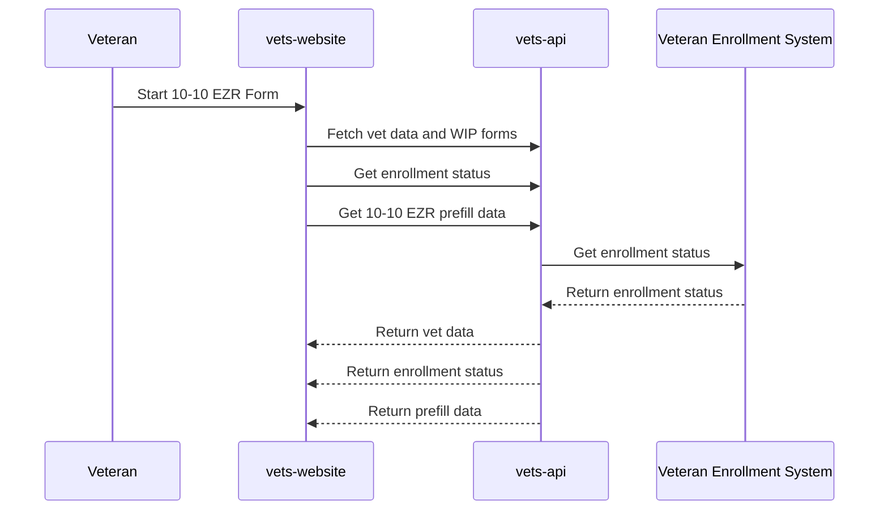
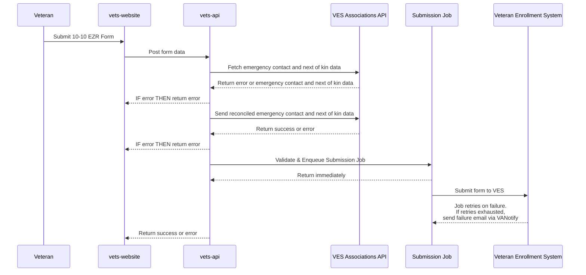

# 10-10EZR

## Description

Mission: Make it easier for Veterans to update their VA health benefits information after enrollment.

Use the Health Benefits Update Form (VA Form 10-10EZR) to update your personal, financial, insurance, or military service history information after you're enrolled in VA health care.

## Project Documentation

- [Product Documents](https://github.com/department-of-veterans-affairs/va.gov-team/tree/master/products/health-care/application/health-update-form)
- [Content Source of Truth](https://github.com/department-of-veterans-affairs/va.gov-team/blob/master/products/health-care/application/health-update-form/10-10EZR%20Form/10-10EZR-application-content.md)
- [Engineering Documentation](https://github.com/department-of-veterans-affairs/va.gov-team/tree/master/products/health-care/application/health-update-form/Engineering)

## Slack Channels

- [health-apps](https://dsva.slack.com/archives/CMJ2V70UV)

## Approval Groups

- [Health Apps Frontend](https://github.com/orgs/department-of-veterans-affairs/teams/health-apps-frontend)

### Project URLs

```markdown
/my-health/update-benefits-information-form-10-10ezr/
```

### How to run locally

**Quick start:**
```bash
# Start the application
yarn run watch --env entry=ezr

# Start the mock API (ensure vets-api is NOT running locally)
yarn mock-api --responses ./src/applications/ezr/tests/mock-api.js

# In browser console to bypass authentication:
localStorage.setItem('hasSession', true)
```

**Mock API for local testing:**
The EZR application includes a comprehensive mock API that serves all necessary endpoints for local development. The mock API provides test data for:
- User authentication and profile data
- Feature toggles
- Enrollment status
- Maintenance windows
- CMS content
- In-progress form data
- PDF download functionality
- Form submission handling

**Customizing mock responses:**
The mock API is located at `./src/applications/ezr/tests/mock-api.js`. You can customize responses by modifying the `responses` object in this file. Each key represents an API endpoint, and the value is the mock response data.

**Redux DevTools:**
Redux DevTools are automatically enabled in development mode. Install the [Redux DevTools Extension](https://github.com/reduxjs/redux-devtools) in your browser to inspect application state, actions, and time-travel debugging.

**Testing with real authentication:**
For testing with actual VA user accounts, use ID.me instead of Login.gov to allow for test accounts within lower environments to be used.

Review Instances require an additional step to get the login to work. When you click on Sign in, a sign in modal appears, but before you click the id.me button, go to the URL and make sure that the `oauth` parameter in the URL is set to false and not true - `&oauth=false`. Once you adjusted the URL, click Enter to go to the new URL and the page should refresh. Now you can log in as normal.

### VA Forms

We are using version 1 of the forms library, Formation. This is a standard form that uses [the vets-json-schema](https://github.com/department-of-veterans-affairs/vets-json-schema) to validate the shape of the data.

### What can Veterans update with this form?

Veterans can update the following information:

**Financial Information:**
- Marital status
- Dependent information  
- Income information from the previous year for veteran, spouse, and dependents
- Deductible expenses from the previous year

**Personal Information:**
- Phone number, email address, mailing address
- Emergency contact and next of kin information

**Insurance Information:**
- All health insurance companies that cover the veteran
- Coverage through spouse or significant other
- Medicare, private insurance, or employer insurance

**Military Service History:**
- Details about exposure to toxins or other hazards
- Supporting documents about exposure history
- Service dates and locations

### What API(s) does this use?

This uses the Health Care Application EZR API endpoints:

- [`/v0/form1010_ezrs`](https://github.com/department-of-veterans-affairs/vets-api) - Form submission API
- [`/v0/form1010_ezr_attachments`](https://github.com/department-of-veterans-affairs/vets-api) - File upload API for supporting documents
- [`/v0/health_care_applications/enrollment_status`](https://github.com/department-of-veterans-affairs/vets-api) - Enrollment status fetch API
- [`/v0/form1010_ezrs/download_pdf`](https://github.com/department-of-veterans-affairs/vets-api) - Download a pre-filled 10-10EZR PDF form upon submission
- [`/v0/in_progress_forms/10-10EZR`](https://github.com/department-of-veterans-affairs/vets-api) - In progress form data API
- [`/v0/feature_toggles`](https://github.com/department-of-veterans-affairs/vets-api) - Feature toggle API
- [`/v0/user`](https://github.com/department-of-veterans-affairs/vets-api) - User data API
- [`/v0/maintenance_windows`](https://github.com/department-of-veterans-affairs/vets-api) - Maintenance window API


### Feature toggles

- Names start with `ezr` for both long-lived and feature-development toggles:
- `ezrProdEnabled` - Enables the EZR application in production
- Some overarching Health Applications functionality, prefixed with `hca`, also affects EZR:
- `ezrBrowserMonitoringEnabled` - Enables DataDog browser monitoring for the application

### Data Flow

The form data ultimately goes to the VA's health care systems to update the veteran's enrollment information. This helps determine:
- Copay requirements for non-service-connected care
- Prescription medicine costs
- Eligibility for travel pay reimbursement
- Priority group placement

#### Form Filling Flow



#### Form Submission Flow



### Useful Commands

<details>

<summary>Redux devtools dispatch command example (requires Redux DevTools extension in browser)</summary>

```
{
  type: 'SET_DATA',
  data: {
    'view:preferredFacility': {
      'view:facilityState': 'WA',
      vaMedicalFacility: '668QE'
    },
    'view:locator': {},
    'view:hasHealthInsuranceToAdd': false,
    isMedicaidEligible: false,
    gulfWarService: false,
    hasTeraResponse: true,
    vaCompensationType: 'highDisability',
    email: 'test@test.com',
    veteranAddress: {
      street: '123 street',
      street2: 'city',
      city: 'city',
      postalCode: '12345',
      country: 'USA',
      state: 'AK'
    },
    'view:doesMailingMatchHomeAddress': true,
    'view:demographicCategories': {
      isAsian: false,
      isBlackOrAfricanAmerican: false,
      isSpanishHispanicLatino: false
    },
    gender: 'M',
    'view:placeOfBirth': {
      cityOfBirth: 'City',
      stateOfBirth: 'AL'
    },
    veteranDateOfBirth: '2000-02-02',
    veteranHomeAddress: {
      country: 'USA'
    },
    'view:registrationOnlyNote': {},
    'view:serviceHistory': {},
    'view:gulfWarServiceDates': {},
    'view:dateRange': {},
    'view:otherToxicExposures': {},
    'view:toxicExposureDates': {},
    spouseFullName: {},
    spouseAddress: {
      country: 'USA'
    },
    dependents: [],
    'view:veteranGrossIncome': {},
    'view:veteranNetIncome': {},
    'view:veteranOtherIncome': {},
    'view:spouseGrossIncome': {},
    'view:spouseNetIncome': {},
    'view:spouseOtherIncome': {},
    'view:deductibleMedicalExpenses': {},
    'view:deductibleEducationExpenses': {},
    'view:deductibleFuneralExpenses': {},
    isEssentialAcaCoverage: false,
    'view:isLoggedIn': false,
    'view:isRegOnlyEnabled': false,
    'view:isInsuranceV2Enabled': true,
    'view:totalDisabilityRating': 0,
    'view:isUserInMvi': false,
    'view:veteranInformation': {
      veteranFullName: {
        first: 'Reele',
        last: 'Steel'
      },
      veteranDateOfBirth: '2000-02-02',
      veteranSocialSecurityNumber: '623123612'
    },
    privacyAgreementAccepted: false
  }
}
```

</details>

- For the source of the above snippet, [see here](https://dsva.slack.com/archives/C05Q6411HPF/p1749491093401949)

- Run mock api (for vets-api):
`yarn mock-api --responses ./src/applications/ezr/tests/mock-api.js`

- Build and watch EZR:
`yarn run watch --env entry=ezr`

- Run cypress for a specific test:
`yarn cy:run --spec "path/to/test-file.cypress.spec.js"`

- Run unit test for a specific file:
`yarn test:unit --path "path to file.unit.spec.js"`

- Run unit tests for a specific folder:
`yarn test:unit --app-folder ezr` (for example, to run all unit tests in the EZR app)

### Useful acronyms and terms

- EZR - Health Benefits Update Form
- TERA - Toxic Exposure Risk Activity
- MVI - Master Veteran Index (used for enrollment status checks)
