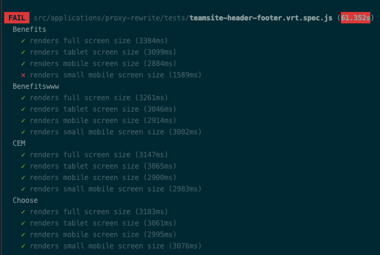
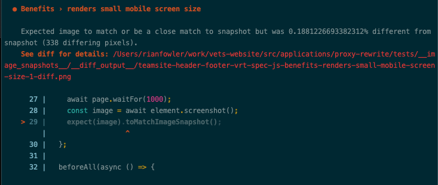

# Proxy Rewrite (AKA Injected header/footer support)
This `proxy-rewrite` application is used to inject site-wide VA.gov components into webpages and domains outside of those in our domain or in our source code. The affected sites are generally referred to as "TeamSite", because TeamSite is the name of the CMS in use on those pages.

## Business case / Ownership
The VA.gov modernization project will take years to bring all VA content from various administrations into the modernized VA.gov experience. In the meantime, VA offices / orgs that use TeamSite (old CMS) may want to adopt the new header/ footer, which provides links to modernized benefit information to Veterans. TeamSites can receive the “injected” header / footer, using a set of Javascript / stylesheets, and a cookie.

**Injection will only work for standard TeamSites.** The header/footer cannot be injected into other VA sites/CMSs.

The injected header and proxy-rewrite app are owned by the Sitewide Public Websites team (VA PO = Dave Conlon). If a new site requires the injected header, check [Injected Header product Runbook documentation](https://github.com/department-of-veterans-affairs/va.gov-team/blob/master/products/header-footer/injected-header/README.md#runbook-adding-injected-header-to-new-teamsite) for more information on how to request.  

## How does the injected header get injected?
The code responsible for doing the injection is found in `proxy-rewrite-entry.jsx`. When that code is run in the browser, it effectively looks for an existing header and footer and then replaces those with the new header and footer.

### How does the code in `proxy-rewrite-entry.jsx` make its way to the browser?
[DEPO teamsite overview](https://depo-platform-documentation.scrollhelp.site/developer-docs/teamsite-overview) - contains more context and explains the cookie mechanisms, and notes on testing. 

`proxy-rewrite-entry.jsx` makes its way to the browser because there's a script tag in the `<head>` of the HTML document:
```
<script type="text/javascript" src="https://prod-va-gov-assets.s3-us-gov-west-1.amazonaws.com/generated/proxy-rewrite.entry.js"></script>
```
(note: `proxy-rewrite-entry.jsx` is packaged up and compiled down to `proxy-rewrite.entry.js`).

That script tag is [part of the HTML generated by the TeamSite page](https://depo-platform-documentation.scrollhelp.site/developer-docs/teamsite-overview#TeamSiteoverview-ScriptsandTeamSiteAdministration).

From there a cookie is enabled as `true` that allows for testing pre-production. When a TeamSite has verified presentation and the injected header is ready to be presented in production, that cookie is updated in the white list file, set to `false`.

## That sounds normal. So what's the "proxy" all about?
In short, the "proxy" piece is used to enable local development. Because we're dependent on the DOM of webpages outside of our source code, it's not straightforward to render the local header and footer on these pages to test functionality as it's being developed. Because we cannot directly render these pages locally at all, we need a workaround. This "proxy" piece provides that workaround by creating a mechanism that enables rendering the local header and footer on the production TeamSite pages.

There are two ways to harness this mechanism:

### First way: `yarn watch local-proxy-rewrite`

Running the `watch` command with a `local-proxy-rewrite` flag enables the local Webpack dev server to act kind of like a proxy. When the server is enabled with this flag, and when it subsequently receives a request for a URL that includes a `target` query parameter (e.g. http://localhost:3001/?target=https://www.va.gov/health), it fetches the html of the page indicated in that query parameter and *rewrites* the URLs for certain production resources so that they are instead served locally.

Example:
```
<script type="text/javascript" src="https://prod-va-gov-assets.s3-us-gov-west-1.amazonaws.com/generated/proxy-rewrite.entry.js"></script>
```
Becomes:
```
<script type="text/javascript" src="generated/proxy-rewrite.entry.js"></script>
```

Then, the Webpack dev server returns the adjusted HTML as the response to the original request, which has the effect of serving the `target` page with the local JS that will ultimately render the header and footer.


#### Recap/Steps:
1. First, we need to make sure there exists a `headerFooter.json` file in `vets-website/build/localhost/generated/`. This file should be generated by running a build on `content-build`.

2. Start up `vets-website`:

```
yarn watch local-proxy-rewrite
```

3. Navigate to localhost, but passing a VA.gov domain via a `target` query parameter -

```
http://localhost:3001/?target=https://www.va.gov/health/
```

Now, `https://www.va.gov/health/` should load, but with your local `proxy-rewrite` bundle injected into the page. You can confirm this by checking you network requests or by adding an `alert` into your bundle entry.

### Second way: Charles Proxy
You can also use an application called Charles Proxy to map the `proxy-rewrite` bundles of TeamSite pages to your local machine. This way you can navigate directly to `https://www.va.gov/health/` and when the request for the production bundle of `proxy-rewrite` is sent, Charles will have overridden that file to instead be served locally. Instructions to set this up are located here, https://depo-platform-documentation.scrollhelp.site/developer-docs/charles-proxy-setup-for-teamsite.

## What To Do When The Test Fails
- If needed, run `npm run vrt` locally
- The test log will show a
  - Summary of successes and failures
 
  - Failure details for each test with path to diff image for failure
 
- **If failure is caused by production issue**
  - Repair issue and publish to production
  - Verify `npm run test:vrt` succeeds
- **If failure is caused by an update**
  - Run `npm run test:vrt:baseline`
  - Check in new baseline images to `vets-website`


# Gotchas
1. **Whitelisting must consider root vs. path,** if a path within a domain is receiving injection, e.g. https://github.com/department-of-veterans-affairs/vets-website/commit/74e156a10b2d58c040981c99f454d2ccb5cdcb1d.

2. **Footer injection requires specific markup.** Injection was configured with the expectation that we are injecting into the standard TeamSite template. In TeamSites, the footer is preceded by 2 `div`s: `sub-footer` and `small-print`. If those divs are not present in the template, footer will not inject.

3. **Header may affect font size for the page** to 12px. Specifying font size via scaling may result in too large text loading, then abruptly adjusting to the correct size after the header completes injection.  Other teams have fixed this by resetting the default font size inside the first element which would appear under the header after injection via inline css. This seems to keep the app fonts consistent without the awkward large to small size change on page load.
