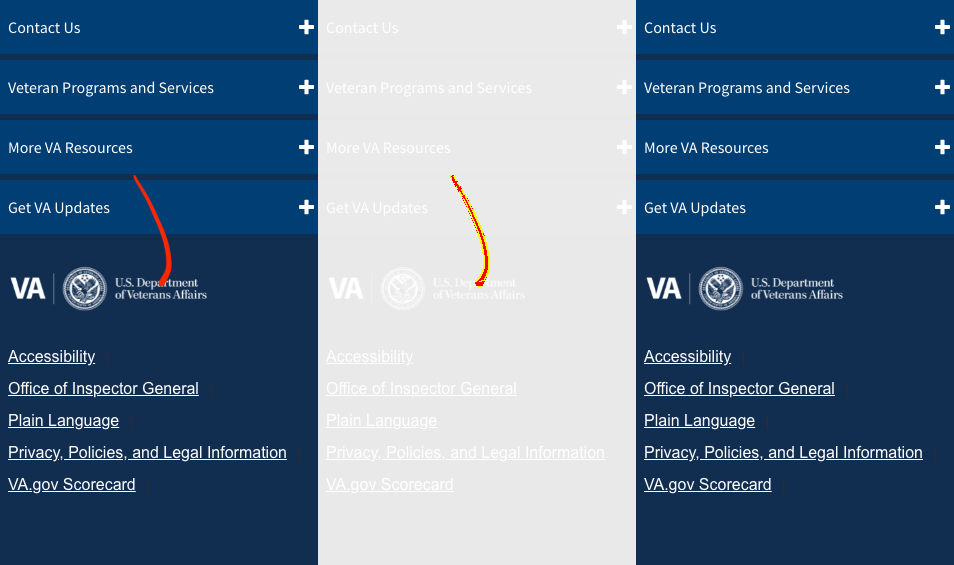

# Proxy Rewrite
This `proxy-rewrite` application is used to inject site-wide VA.gov components into webpages and domains outside of those in our domain or in our source code. The affected sites are generally referred to as "TeamSite", because TeamSite is the name of the CMS in use on those pages.

This works by -

1. A request is sent to a VA.gov website
2. The request passes through the www.va.gov servers, where a code snippet is added into the page
3. This code snippet is ultimately a link to the production `proxy-rewrite` bundle, where the `proxy-rewrite-entry` begins processing the page.
4. If the webpage is listed in the `proxy-rewrite-whitelist.json`, the site-wide components are rendered onto the page.

## Local Dev
Because we're dependent on the DOM of webpages outside of our source code, local development is somewhat tricky. However, to make this easier, you can start a local proxy, which will load a VA domain and replace the injection JS bundle with yours. The reason this behavior is not enabled by default is that we don't want to hit the production servers unless we have to, which is the case for TeamSite development.

```bash
# In one terminal...
node src/applications/proxy-rewrite/teamsite-proxy.js # -> Starts a proxy on localhost:3500

# In another...
yarn watch --env.entry proxy-rewrite
```

Next, navigate to localhost, but passing a VA.gov domain via a `target` query parameter -

```
http://localhost:3500/?target=https://www.va.gov/health/
```

`https://www.va.gov/health/` should load, but with your local `proxy-rewrite` bundle injected into the page. You can confirm this by checking you network requests or by adding an `alert` into your bundle entry.


### Redirects
We use this bundle to perform redirects on VA pages that are not on our domain - any domain outside of `www.va.gov`. These redirects are client-side. It is done this way because requests to non-www domains do not pass through our infrastructure so we have no ability to redirect them at the server-level.

You can execute the E2E test for redirects via by -

```bash
# start Webpack
yarn watch --env.entry proxy-rewrite

# The e2e test will start the TeamSite proxy server itself
yarn test:e2e src/applications/proxy-rewrite/redirects.e2e.spec.js
```

## Charles Proxy
You can also use an application called Charles Proxy to map the `proxy-rewrite` bundles of TeamSite pages to your local machine. This way you can navigate directly to `https://www.va.gov/health/` and when the request for the production bundle of `proxy-rewrite` is sent, Charles will have overridden that file to instead be served locally. Instructions to set this up are located here, https://github.com/department-of-veterans-affairs/vets.gov-team/blob/master/Work%20Practices/Engineering/Teamsite.md.

## Teamsite Visual Regression Testing

Both scripts compare production Teamsite header and footer against images in `vets-website` repo

- `npm run vrt` - test fails and generates diff images when images differ
- `npm run vrt:baseline` - test always succeeds and replaces existing baseline images when images differ

- If no baseline images exist for a test, both scripts will
  - succeed on each test that has no baseline image and
  - generate a new baseline image for it.
- Diff images are removed automatically when their associated test succeeds.

### Details
- compares snapsshots of `<header>` and `.footerNav` on current subdomain Teamsite pages
- [jest-image-snapshot](https://github.com/americanexpress/jest-image-snapshot) uses [pixelmatch](https://github.com/mapbox/pixelmatch) to detect failure
- Diff images show **left center right** the **baseline diff new** images


## What To Do When The Test Fails
- If needed, run `npm run vrt` locally
- The test log will show a
  - Summary of successes and failures
 
  - Failure details for each test with path to diff image for failure
 
- **If failure is caused by production issue**
  - Repair issue and publish to production
  - Verify `npm run test:vrt` succeeds
- **If failure is caused by an update**
  - Run `npm run test:vrt:baseline`
  - Check in new baseline images to `vets-website`
