# Form 21-4142 Flow Diagram

This document describes the flow of the VA Form 21-4142 "Authorization to disclose information to the Department of Veterans Affairs".

```mermaid
flowchart TD
    Start([Start Form]) --> Intro[Introduction Page]
    Intro --> PersonalInfo1[Personal Information 1<br/>Veteran's basic info]

    PersonalInfo1 --> PersonalInfo2[Personal Information 2<br/>Veteran's identification]
    PersonalInfo2 --> Contact1[Contact Information 1<br/>Veteran's mailing address]
    Contact1 --> Contact2[Contact Information 2<br/>Veteran's phone/email]

    Contact2 --> PatientID1[Patient Identification 1<br/>Are you requesting your own records?]

    PatientID1 --> PatientID1Decision{Requesting own<br/>medical records?}
    PatientID1Decision -->|Yes - Veteran's records| Authorization[Authorization<br/>Provider facility info]
    PatientID1Decision -->|No - Someone else's records| PatientID2[Patient Identification 2<br/>Whose records are you releasing?]

    PatientID2 --> Authorization

    Authorization --> Records[Treatment Records<br/>Records requested info]
    Records --> Limitations[Limitations<br/>Limit information request?]

    Limitations --> PreparerID[Preparer Identification<br/>Who is submitting this?]

    PreparerID --> PreparerDecision{Relationship to Veteran}

    PreparerDecision -->|"I am the Veteran"| Complete[Review & Submit]
    PreparerDecision -->|Spouse/Child<br/>Direct Relative| PreparerPersonal[Preparer Personal Info<br/>Name, title, organization]
    PreparerDecision -->|Other Relationships<br/>Fiduciary, VSO, etc| PreparerPersonal

    PreparerPersonal --> AddressDecision{Is preparer a<br/>direct relative?}

    AddressDecision -->|Yes - Spouse/Child| PreparerAddr1[Preparer Address 1<br/>Same as Veteran's address?]
    AddressDecision -->|No - Other relationship| PreparerAddr2[Preparer Address 2<br/>Full address required]

    PreparerAddr1 --> SameAddressDecision{Same address<br/>as Veteran?}
    SameAddressDecision -->|Yes| Complete
    SameAddressDecision -->|No| PreparerAddr2

    PreparerAddr2 --> Complete

    Complete --> Confirmation[Confirmation Page]

    %% Styling
    classDef startEnd fill:#e1f5fe
    classDef decision fill:#fff3e0
    classDef process fill:#f3e5f5
    classDef conditional fill:#e8f5e8

    class Start,Confirmation startEnd
    class PatientID1Decision,PreparerDecision,AddressDecision,SameAddressDecision decision
    class PersonalInfo1,PersonalInfo2,Contact1,Contact2,Authorization,Records,Limitations,Complete process
    class PatientID2,PreparerPersonal,PreparerAddr1,PreparerAddr2 conditional
```



## Key Decision Points and Conditional Logic

### 1. Patient Identification Logic
- **patientIdentification1**: Always shown - asks if requesting own medical records
- **patientIdentification2**: Only shown if answer is "No" (requesting someone else's records)
  ```javascript
  depends: formData => !formData.patientIdentification.isRequestingOwnMedicalRecords
  ```

### 2. Preparer Information Logic
The form has complex conditional logic based on the relationship to the Veteran:

#### Preparer Personal Information
- **Shown when**: Relationship is NOT "I am the Veteran"
  ```javascript
  depends: formData =>
    formData.preparerIdentification.relationshipToVeteran !== "I am the Veteran"
  ```

#### Preparer Address Logic
The address section has two conditional pages:

##### Preparer Address 1 (Address comparison)
- **Shown when**: Preparer is a direct relative (Spouse or Child)
  ```javascript
  depends: formData =>
    ["Spouse", "Child"].includes(formData.preparerIdentification.relationshipToVeteran)
  ```

##### Preparer Address 2 (Full address)
- **Shown when**: Either:
  - Preparer doesn't have same address as Veteran, OR
  - Preparer is NOT a direct relative (Spouse/Child)
  - AND relationship is NOT "I am the Veteran"
  ```javascript
  depends: formData =>
    (!formData.preparerIdentification.preparerHasSameAddressAsVeteran ||
     !["Spouse", "Child"].includes(formData.preparerIdentification.relationshipToVeteran)) &&
    formData.preparerIdentification.relationshipToVeteran !== "I am the Veteran"
  ```

### 3. Relationship Types
- **"I am the Veteran"**: Shortest path - no preparer info needed
- **Direct Relatives** (Spouse, Child): Address comparison option available
- **Other Relationships** (Fiduciary, VSO, Alternate signer, Third-party): Full preparer info and address required

### 4. Environment-Specific Logic
- **Records Requested page**: Simplified structure in production vs. development
  ```javascript
  pages: environment.isProduction() ? { recordsRequested: {...} } : recordsRequested
  ```

## Form Structure Summary
1. **Linear Section**: Personal info, contact info (always shown)
2. **Patient ID Branch**: Conditional second page based on whose records
3. **Authorization & Records**: Always shown
4. **Preparer Branch**: Complex conditional logic based on relationship
5. **Review & Submit**: Final step

This form demonstrates a hub-and-spoke pattern where the preparer identification serves as the main decision point that determines multiple downstream conditional pages.
