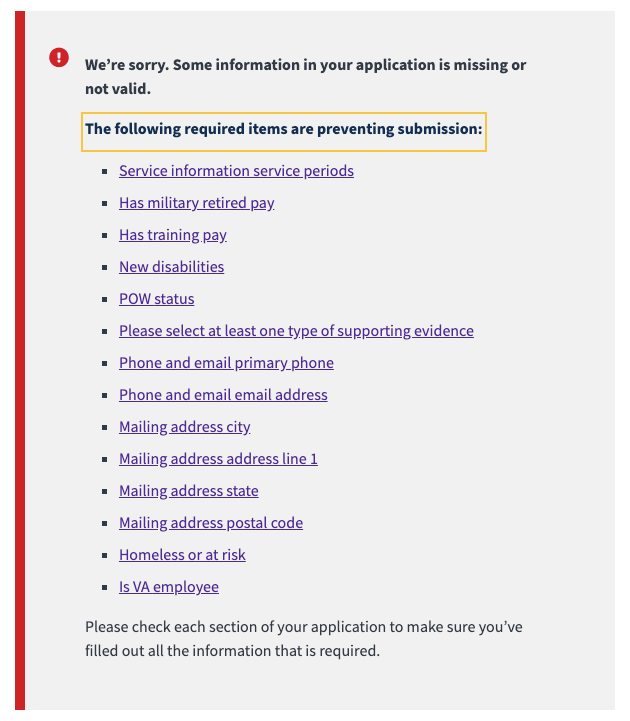

## Review Errors

To provide a better user experience on a form's review & submit page, an update to form 526 error alert was made to provide Veteran's with a list of clickable errors.

Clicking the link would open the appropriate accordion chapter and place the associated page into edit mode.


## Set up

To enable error links in your form, you'll need to update the `config/form` file with two new entries:
- `showReviewErrors` is a boolean flag that is required to enable review error links on the review & submit page. For form 526, we initially set this to `!environment.isProduction()` to enable testing on staging.
- `reviewErrors` is an object set with the key that matches the uiSchema name of entry. The value can be either a string or a function that returns a string. More details are provided below.

Here's an example:

```js
const formConfig = {
  // ...
  showReviewErrors: !environment.isProduction(),
  reviewErrors: {
    primaryPhone: 'Contact information (enter your phone number)',
    emailAddress: 'Contact information (enter your email address)',
    // condition is an array path, so an index is passed as a parameter
    condition: index =>
      `Add a new conditions (in the ${numberToWords(index + 1)} section`,
  },
  // ...
};
```

## How it works

A third-party schema validation script (https://github.com/tdegrunt/jsonschema) is run upon form submission. The errors are combined with some uiSchema error messages and are reduced, then added to the redux state under `form.formErrors.errors`. The third-party validator doesn't have access to all the `uiSchema` error messages, so if a `reviewErrors` entry isn't provided, the link text is build from the error key. This isn't always ideal.

The following screenshot shows the same errors as in the screenshot above, but without a provided `reviewErrors` cross-reference.



The `reviewErrors` text can be reviewed by your content team to provide the best content for that specific form entry.
